[OpenGL 3D Advanced 2020 第01回]

# スケルタルメッシュって何でできてるの？

骸骨と関節、そして行列、そういうものでできてるよ

## 習得目標

* 関節を行列によって表す方法
* 行列の合成
* 行列によるスケルトンの作成

## 1. 関節を行列で表す

### 1.1 個別のローカル座標系

自動車のモデルを作ることを考えます。例えば、全体を一つのモデルとして作ることができるでしょう。どこかに飾るだけならこれで問題はありません。この自動車モデルは一つのローカル座標系を持ちます。

<p align="center">
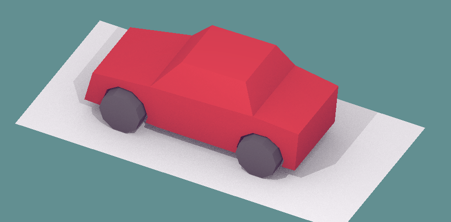
</p>

この車を移動させたり向きを変えるには、ローカル座標系を移動させたり回転させたりします。

自動車を移動させるときに、車輪を回転させて自動車が進んでいるように見せたいと考えるものです。しかし、一つのモデルのままで回転させようとすると、車輪だけでなく車体まで回転してしまいます。そこで、車輪と車体を別のモデルに分けて、組み合わせることにします。

<p align="center">
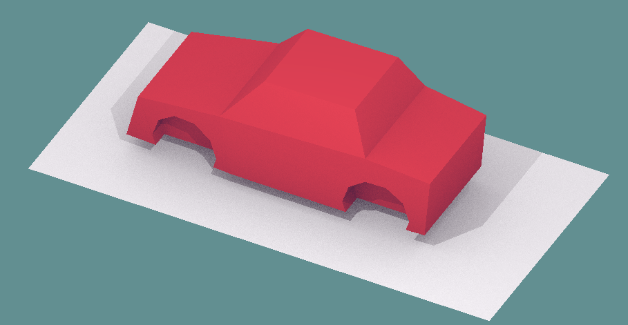＋
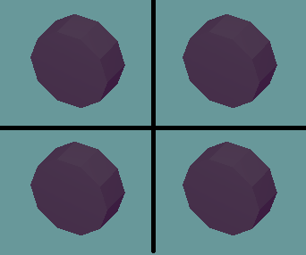＝

</p>

モデルを分けたので、車輪と車体はそれぞれが別個のローカル座標系を持ちます。そのため、この自動車モデルには合計5つのローカル座標系があることになります。自動車を移動させるには、まず車輪のローカル座標系を回転させて、それから車輪を車体の4箇所に移動させます。それから、車体と車輪のローカル座標系を移動させます。

<p align="center">
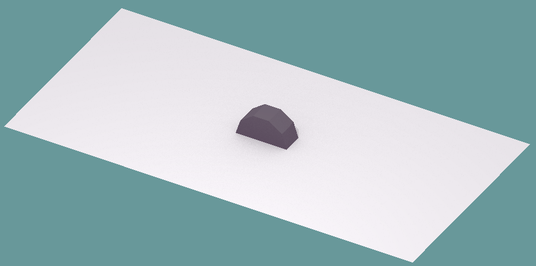→
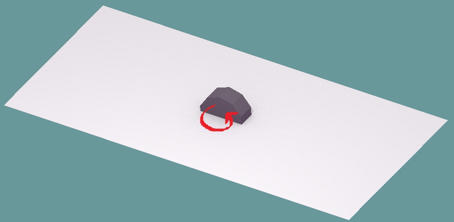→
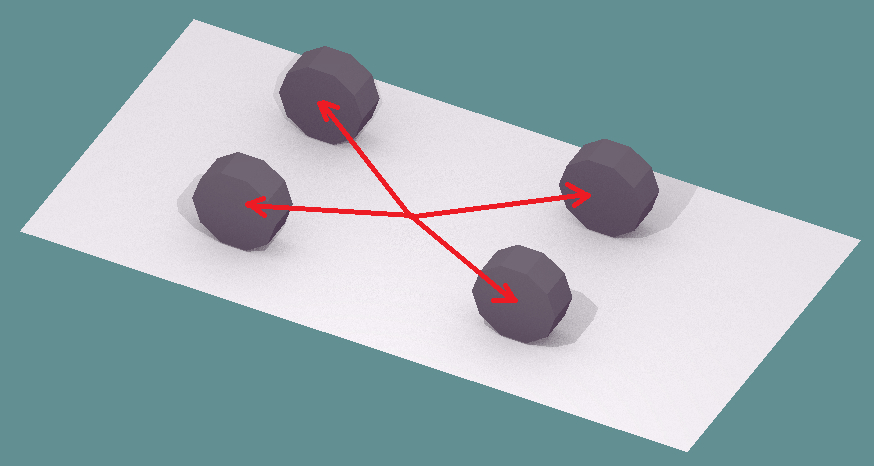→
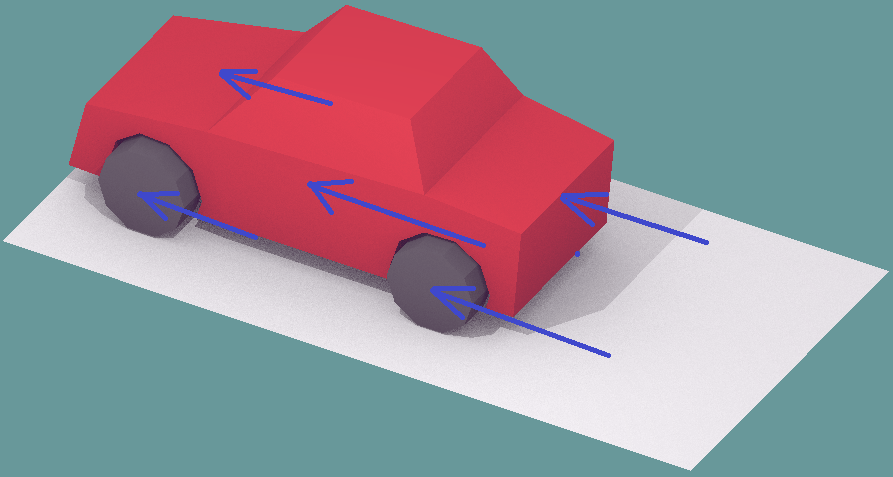
</p>

いい感じに動かすことができました。

### 1.2 座標系を行列であらわす

移動や回転などの座標系に対する操作は、行列で表現します。行列を使うと、回転や移動をしたあとの車輪の座標は、次の式で計算できます。

>```txt
>回転後の車輪の座標             = 車輪を回転させる行列 * 車輪の座標
>回転・移動後の車輪の座標       = 車輪を車体の所定位置へ移動させる行列 * 車輪の座標
>車体の旋回後の車輪の座標       = 車体を旋回させる行列 * 回転・移動後の車輪の座標
>車体の旋回・移動後の車輪の座標 = 車体を移動させる行列 * 車体の旋回後の車輪の座標
>```

これをローカル座標系単位でまとめると次のようになります。

>```txt
>車輪のローカル行列 = 車輪を車体の所定位置へ移動させる行列 * 車輪を回転させる行列
>回転・移動後の車輪の座標 = 車輪のローカル行列 * 車輪の座標
>
>車体のローカル行列 = 車体を移動させる行列 * 車体を回転させる行列
>車体の旋回・移動後の車輪の座標 = 車体のローカル行列 * 回転・移動後の車輪の座標
>```

さらに「回転・移動後の車輪の座標」を置き換えると次のようになります。

>```txt
>車輪のローカル行列 = 車輪を車体の所定位置へ移動させる行列 * 車輪を回転させる行列
>車体のローカル行列 = 車体を移動させる行列 * 車体を回転させる行列
>
>車体の旋回・移動後の車輪の座標 = 車体のローカル行列 * 車輪のローカル行列 * 車輪の座標
>```

このように、座標系の操作は行列の乗算によってあらわすことができます。

また、「車体の旋回・移動後の車輪の座標」というのは、「車輪のワールド座標」と言い換えることができます。そして、「車輪の座標」は「車輪のローカル座標」と言い換えられるでしょう。

>```txt
>車輪のワールド座標 = 車体のローカル行列 * 車輪のローカル行列 * 車輪のローカル座標
>```

### 1.3 親ローカル座標系と子ローカル座標系

現実の自動車では、車輪は車体にくっついています。だから、車体が旋回すれば、それにともなって車輪も旋回するわけです。このとき、車輪の旋回の中心は、車体の旋回の中心と一致します。

<p align="center">
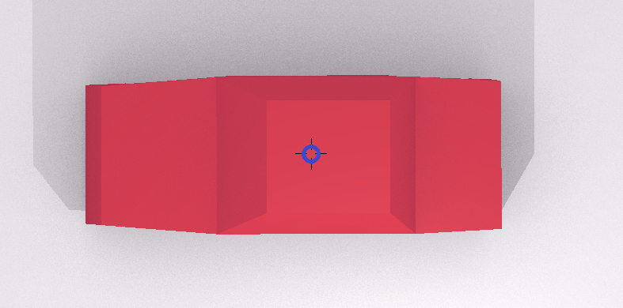
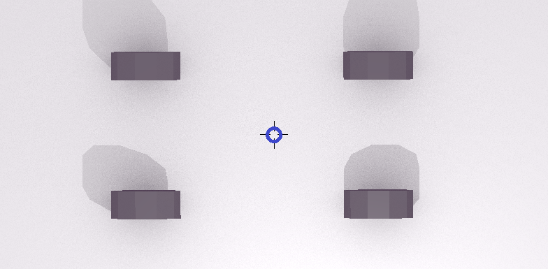<br>
[回転の中心(青い円)は同じ]
</p>

3Dグラフィックスで同じことをするには、車輪のローカル座標系を車体のローカル座標系にくっつけます。これによって、車体のローカル座標系を回転させると、それにともなって車輪のローカル座標系も回転します。このような主従関係のことを、プログラミングでは親と子になぞらえて「親子関係」と呼びます。自動車の例では、「車体が<ruby>親<rt>おや</rt></ruby>」で「車輪が<ruby>子<rt>こ</rt></ruby>」になります。

TODO: ここに「車体ローカル空間にともなって車輪ローカル空間が回転する画像」を貼る

ローカル座標系のあいだに親子関係を作ると、車輪のような複雑な回転を扱えるようになります。そして、1.2節で説明したように、座標系の操作は行列で表現することができます。

1.2節の以下の式は、

>```txt
>車輪のワールド座標 = 車体のローカル行列 * 車輪のローカル行列 * 車輪のローカル座標
>```

親子関係で表すと次のように書けるでしょう。

>```txt
>子のワールド座標 = 親のローカル行列 * 子のローカル行列 * 子のローカル座標
>```

このように、「座標系の親子関係は行列の乗算として表現できる」のです。

>**【プログラミングの親子関係は無性生殖】**<br>
>プログラミングでいう親子関係は「ひとつの親にひとつの子」または「ひとつの親に複数の子」という関係を表します。多くの動物のように、二人の親を持つことはありません。

次に、ロボットアームのモデルについて考えてみましょう。このロボットアームには根本、肘、手首の3つの関節があります。また、先端は溶接機になっていて指はありません。

<p align="center">
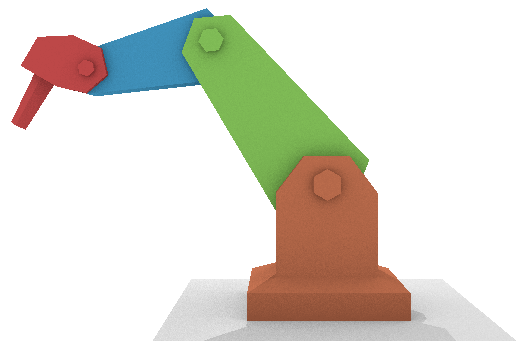
</p>

ロボットアームも単一のモデルとして作ってしまうと関節を動かせません。そこで、根本、上腕、下腕、手の4つのモデルに分割します。自動車と同じく、これらは別々のローカル座標系を持ちますので、ロボットアームのローカル座標系は合計4つということになります。

<p align="center">
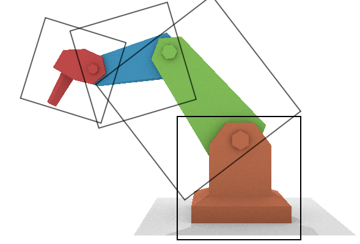
</p>

ロボットアームの場合、根本モデルを親として、その子が上腕モデル、孫が下腕モデル、ひ孫が手モデルという関係になります。この関係を行列で書くと次のようになります。

```txt
根本のローカル→ワールド変換行列 = 根本のローカル行列
上腕のローカル→ワールド変換行列 = 根本のローカル行列 * 上腕のローカル行列
下腕のローカル→ワールド変換行列 = 根本のローカル行列 * 上腕のローカル行列 * 下腕のローカル行列
手のローカル→ワールド変換行列   = 根本のローカル行列 * 上腕のローカル行列 * 下腕のローカル行列 * 手のローカル行列
```

それぞれの式をよく見ると、自分自身の変換行列は、すぐ上の変換行列と自分自身のローカル行列の乗算であることが分かります。

```txt
根本のローカル→ワールド変換行列 = 根本のローカル行列
上腕のローカル→ワールド変換行列 = 根本のローカル→ワールド変換行列 * 上腕のローカル行列
下腕のローカル→ワールド変換行列 = 上腕のローカル→ワールド変換行列 * 下腕のローカル行列
手のローカル→ワールド変換行列   = 下腕のローカル→ワールド変換行列 * 手のローカル行列
```

ロボットアームの根本モデルはワールド座標系に配置されます。これは、ワールド座標系が親になると考えられます。ワールド座標系の行列を追加すると、次のようになります。

```txt
根本のローカル→ワールド変換行列 = ワールド→ワールド変換行列 * 根本のローカル行列
上腕のローカル→ワールド変換行列 = 根本のローカル→ワールド変換行列 * 上腕のローカル行列
下腕のローカル→ワールド変換行列 = 上腕のローカル→ワールド変換行列 * 下腕のローカル行列
手のローカル→ワールド変換行列   = 下腕のローカル→ワールド変換行列 * 手のローカル行列
```

これは、次のようにまとめることができます。

```txt
自分のローカル→ワールド変換行列 = 親の変換行列 * 自分のローカル行列
```

座標系の親子関係は、この単純なルールによって作られているのです。

### 1.4 スケルタルアニメーション

実はこうして親子関係を作るだけでは、「親子関係」という無駄なデータが増えるだけです。親子関係がその真価を発揮するのは、モデルのアニメーションを作成するときです。

最も素朴な方法では、すべての頂点について、1/60秒ごとに座標を記録していきます。この手法は、よほど頂点数が少ないモデルでなければアニメーションデータが巨大になりすぎます。そこで、通常はもっと長い間隔、例えば1/3秒単位でアニメーションデータを作成し、あいだのデータは前後のアニメーションから計算します。こうすることで、かなりアニメーションデータを減らすことが出来ます。

それでも、頂点数が1000を超えるようになると、アニメーションデータはかなり巨大になりすぎます。そこで、モデルをパーツに分割し、それぞれのローカル空間の位置や角度だけを記録します。頂点ごとの細かな動きはつけられませんが、データ数ははるかに少なくなります。

しかし、いずれの方法を取ったとしても、ロボットアームのような関節を持つモデルをきれいに動かすことは非常に難しいのです。関節でつながったモデルは「つながった部分から離れられない」という制約を持ちます。それなのに、上記の2つの手法では、この制約を扱う方法が存在しないのです。そのため、あいだのデータを計算するときに関節が外れた状態ができてしまうことがあるのです。

親子関係であれば、関節の持つ制約を表現できます。この性質のために、関節を親子関係で接続する方法が、現代のアニメーションの主流となったのです。

この、親子関係によって関節のアニメーションを制御する方法のことを「スケルタル・アニメーション」といいます。そして、ひとつひとつの関節をボーンと呼びます。

### 2. 1 再び、ひとつのモデル

自動車やロボットアームのように、パーツに分割できるモデルについては、ここまで説明してきた手法で親子関係を作って動かすことができます。しかし、人間のように分割できないモデルだとそのままでは対応できません。

>**【箱人間でいいのなら】**<br>
>もちろん、マインクラフトに登場するキャラクターのように、モデルを非常に単純化すれば対応できます。

そこで、モデルごとにボーンを割り当てるのではなく、頂点ごとにボーンを割り当てることを考えます。これができれば、頂点ごとにボーンによってアニメーションさせることができます。ローカル座標系はボーンごとに存在するので、ひとつのモデルに複数のローカル座標系が存在できなければなりません。

しかし、ひとつのモデルにはひとつのローカル座標系しか存在できません。この矛盾を解決しないかぎり、分割できないモデルにスケルタルアニメーションを使うことはできないのです。

ロボットアームのようにパーツごとに分割できるモデルでは、全てのモデルは原点にあります。そして、それぞれのローカル行列によって、ワールド座標系の適切な位置に移動していくわけです。

<p align="center">
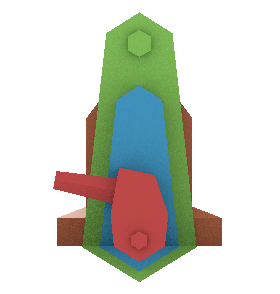→
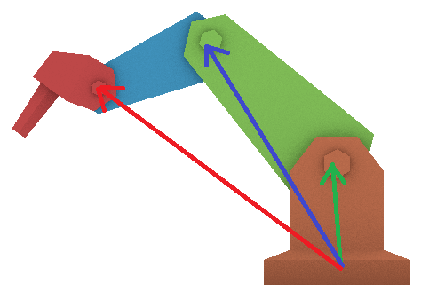
</p>

ロボットアームがひとつのモデルであり、パーツの頂点ごとにボーンに割り当てられているとします。このモデルにそれぞれのローカル行列を適用すると、次のようにパーツの位置が大きくずれてしまいます。

<p align="center">
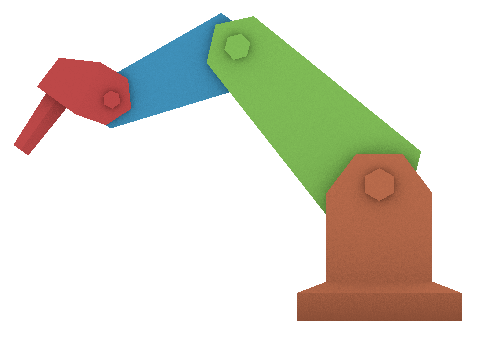→
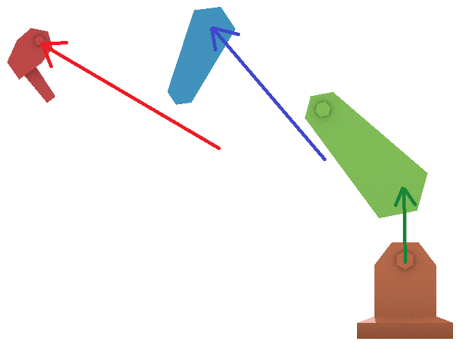
</p>

ひとつのモデルの各パーツの位置や角度は、パーツ分割モデルにローカル行列を掛けたのと同じ状態です。つまり、既に所定のローカル行列を掛けたあとなのです。そのため、ローカル行列を2回掛けたような結果になってしまうわけです。

### 2.2 バインドポーズ行列

この問題を解決するためには、最初のローカル行列の影響を打ち消さなくてはなりません。そのために、新たに「バインドポーズ行列」と「逆バインドポーズ行列」という2種類の行列を導入します。

「バインド・ポーズ」というのは、モデルのローカル座標系で定義された、何のアニメーションもしていない素の状態のボーンの姿勢のことです。バインドポーズ行列は、ボーンのローカル座標系をモデルのローカル座標系に変換します。

<p align="center">
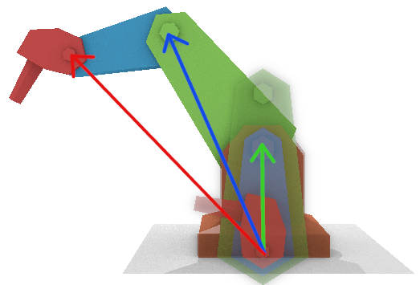<br>
[ボーンローカル座標系→モデルローカル座標系]
</p>

つまりバインドポーズ行列は、「バインドポーズに変換するためのローカル行列」ということです。もしパーツ分割モデルにバインドポーズ行列を掛けたとしたら、ひとつのモデルと同じ状態になるでしょう。

逆バインドポーズ行列は、名前の通りバインドポーズ行列の逆の操作をします。つまり、座標をモデルのローカル座標系からボーンのローカル座標系へと変換します。

<p align="center">
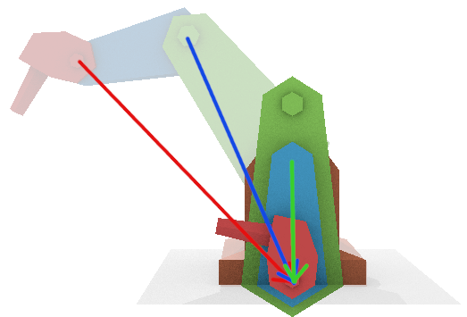<br>
[モデルローカル座標系→ボーンローカル座標系]
</p>

モデルの頂点に逆バインドポーズ行列を掛けると、パーツ分割モデルにローカル行列を掛ける前と同じ状態を作り出すことができます。つまり、最初のローカル行列の影響を打ち消すことができるわけです。そうなれば、あとはパーツ分割モデルと全く同じ方法で、ワールド座標系へと変換することができます。

バインドポーズ行列と逆バインドポーズ行列によって頂点を変換することが、スケルタルメッシュの基本となります。

### 2.3 ボーンウェイトと座標補間

人間の関節を観察すると、関節の根本にある皮膚は、完全に一方の関節だけに引っ張られるのではないことが分かります。この挙動を再現するために、スケルタルメッシュでは「ボーンウェイト」という数値を使ってボーンの影響度合いを設定します。

すべての頂点には、その頂点に影響を与える複数の「ボーンID」と、各ボーンが及ぼす影響の強さを示す「ボーンウェイト」というパラメータを設定します。

実際のアニメーションでは、まずボーンIDに対応する座標変換行列を使って座標をワールド座標系に変換します。これを影響するボーンの数だけ行います。

TODO: 複数の座標変換の画像

影響するボーンの全ての座標変換がすんだら、それらをボーンウェイトの比率で合成し、最終的な座標を得ます。

TODO: ボーンウェイトによる合成の画像

これが基本ですが、実際のプログラムでは計算回数を減らすためにちょっと工夫をします。といっても、計算順序を変えるだけです。つまり、座標変換をしてから座標を合成するのではなく、座標変換行列を合成してから座標変換を行います。

影響するボーンが8本あるとします。行列とベクトルの乗算に必要な計算回数`28`回、ベクトルの合成にはボーン1本につき`7`回の計算が必要です。また、行列の合成にはボーン1本につき`28`回の計算が必要です。

座標変換をしてからベクトルを合成する場合、その計算回数は

`28*8 + 7*8 = 280`

となります。行列を合成してから座標変換する場合、その計算回数は

`28*8 + 28 = 252`

となります。このように、行列を合成してから座標変換するほうが計算回数が少なくなるのです。そのため、多くのスケルタルアニメーション・プログラムでは、「行列を合成してから座標変換する」という順序を採用しています。

>**【ボーン数が少ない場合は？】**<br>
>影響するボーンの数が3本以下の場合、座標変換してからベクトルを合成するほうが、計算回数が少なくなります。もし影響するボーン数を3本以下に制限できる場合は「座標変換→合成」の手順を使うとよいでしょう。

### 1.5

`GLM`ライブラリの行列クラスを使って、自動車のローカル座標系を定義すると、次のようになるでしょう。

>```c++
>glm::mat4 matBody;
>glm::mat4 matWheels[4];
>```

`matWheels`は、右前輪、左前輪、右後輪、左後輪、の4つの車輪のローカル行列です。

車輪のローカル座標`posWheel`があるとして、これをワールド座標系に変換する式は次のようになるでしょう。

```c++
posWorldWheelFrontRight = matBody * matWheels[0] * posWheel;
```

ご存知かと思いますが、OpenGLではこの計算は頂点シェーダで行われます。頂点シェーダのモデル行列の位置が変数`locMatModel`に格納されているとすると、次のようなプログラムを書くことになるでしょう。

```c++
glm::mat4 m = matBody * matWheels[0];
glUniformMatrix4fv(locMatModel, 1, GL_FALSE, &m[0][0]);
```


