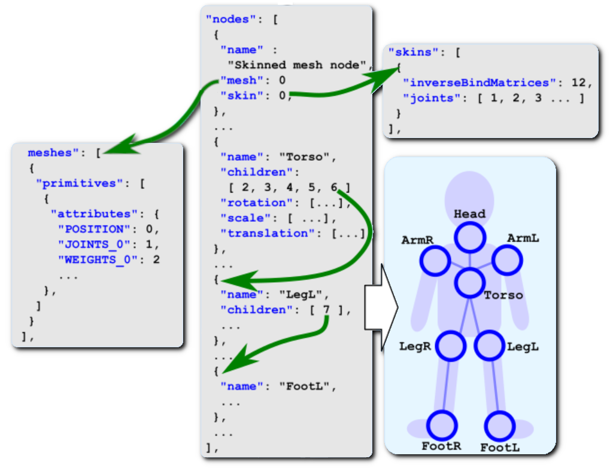
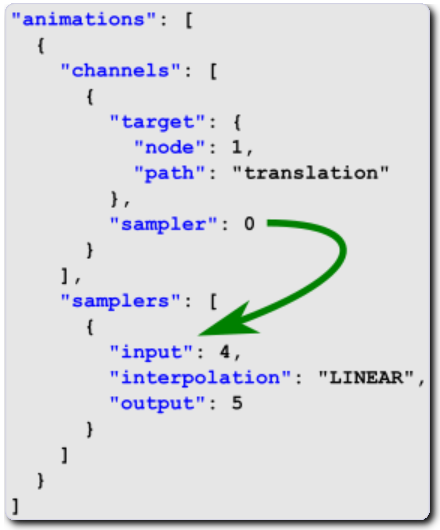

[OpenGL 3D Advanced 2020 第01回]

# スケルタルメッシュって<br>何でできてるの？

関節行列、そして逆バインドポーズ行列<br>そういうものでできてるよ

## 習得目標

* 関節を行列によって表す方法
* 行列によるスケルトンの作成
* glTFからスケルタルメッシュデータを読み込む

## 1. 関節を行列で表す

### 1.1 個別のローカル座標系

自動車のモデルを作ることを考えます。例えば、全体を一つのモデルとして作ることができるでしょう。どこかに飾るだけならこれで問題はありません。この自動車モデルは一つのローカル座標系を持ちます。

<p align="center">

</p>

この車を移動させたり向きを変えるには、ローカル座標系を移動させたり回転させたりします。

自動車を移動させるときに、車輪を回転させて自動車が進んでいるように見せたいと考えるものです。しかし、一つのモデルのままで回転させようとすると、車輪だけでなく車体まで回転してしまいます。そこで、車輪と車体を別のモデルに分けて、組み合わせることにします。

<p align="center">
＋
＝

</p>

モデルを分けたので、車輪と車体はそれぞれが別個のローカル座標系を持ちます。そのため、この自動車モデルには合計5つのローカル座標系があることになります。自動車を移動させるには、まず車輪のローカル座標系を回転させて、それから車輪を車体の4箇所に移動させます。それから、車体と車輪のローカル座標系を移動させます。

<p align="center">
→
→
→

</p>

いい感じに動かすことができました。

### 1.2 座標系を行列であらわす

移動や回転などの座標系に対する操作は、行列で表現します。行列を使うと、回転や移動をしたあとの車輪の座標は、次の式で計算できます。

>```txt
>回転後の車輪の座標             = 車輪を回転させる行列 * 車輪の座標
>回転・移動後の車輪の座標       = 車輪を車体の所定位置へ移動させる行列 * 車輪の座標
>車体の旋回後の車輪の座標       = 車体を旋回させる行列 * 回転・移動後の車輪の座標
>車体の旋回・移動後の車輪の座標 = 車体を移動させる行列 * 車体の旋回後の車輪の座標
>```

これをローカル座標系単位でまとめると次のようになります。

>```txt
>車輪のローカル行列 = 車輪を車体の所定位置へ移動させる行列 * 車輪を回転させる行列
>回転・移動後の車輪の座標 = 車輪のローカル行列 * 車輪の座標
>
>車体のローカル行列 = 車体を移動させる行列 * 車体を回転させる行列
>車体の旋回・移動後の車輪の座標 = 車体のローカル行列 * 回転・移動後の車輪の座標
>```

さらに「回転・移動後の車輪の座標」を置き換えると次のようになります。

<br><br><br>

>```txt
>車輪のローカル行列 = 車輪を車体の所定位置へ移動させる行列 * 車輪を回転させる行列
>車体のローカル行列 = 車体を移動させる行列 * 車体を回転させる行列
>
>車体の旋回・移動後の車輪の座標 = 車体のローカル行列 * 車輪のローカル行列 * 車輪の座標
>```

このように、座標系の操作は行列の乗算によってあらわすことができます。

また、「車体の旋回・移動後の車輪の座標」というのは、「車輪のワールド座標」と言い換えることができます。そして、「車輪の座標」は「車輪のローカル座標」と言い換えられるでしょう。

>```txt
>車輪のワールド座標 = 車体のローカル行列 * 車輪のローカル行列 * 車輪のローカル座標
>```

### 1.3 親ローカル座標系と子ローカル座標系

現実の自動車では、車輪は車体にくっついています。だから、車体が旋回すれば、それにともなって車輪も旋回するわけです。このとき、車輪の旋回の中心は、車体の旋回の中心と一致します。

<p align="center">

<br>
[回転の中心(青い円)は同じ]
</p>

3Dグラフィックスで同じことをするには、車輪のローカル座標系を車体のローカル座標系にくっつけます。これによって、車体のローカル座標系を回転させると、それにともなって車輪のローカル座標系も回転します。このような主従関係のことを、プログラミングでは親と子になぞらえて「親子関係」と呼びます。自動車の例では、「車体が<ruby>親<rt>おや</rt></ruby>」で「車輪が<ruby>子<rt>こ</rt></ruby>」になります。

TODO: ここに「車体ローカル空間にともなって車輪ローカル空間が回転する画像」を貼る

ローカル座標系のあいだに親子関係を作ると、車輪のような複雑な回転を扱えるようになります。そして、1.2節で説明したように、座標系の操作は行列で表現することができます。

1.2節の以下の式は、

>```txt
>車輪のワールド座標 = 車体のローカル行列 * 車輪のローカル行列 * 車輪のローカル座標
>```

親子関係で表すと次のように書けるでしょう。

>```txt
>子のワールド座標 = 親のローカル行列 * 子のローカル行列 * 子のローカル座標
>```

このように、「座標系の親子関係は行列の乗算として表現できる」のです。

>**【プログラミングの親子関係は無性生殖】**<br>
>プログラミングでいう親子関係は「ひとつの親にひとつの子」または「ひとつの親に複数の子」という関係を表します。多くの動物のように、二人の親を持つことはありません。

次に、ロボットアームのモデルについて考えてみましょう。このロボットアームには根本、肘、手首の3つの関節があります。また、先端は溶接機になっていて指はありません。

<p align="center">

</p>

ロボットアームも単一のモデルとして作ってしまうと関節を動かせません。そこで、根本、上腕、下腕、手の4つのモデルに分割します。自動車と同じく、これらは別々のローカル座標系を持ちますので、ロボットアームのローカル座標系は合計4つということになります。

<p align="center">

</p>

ロボットアームの場合、根本モデルを親として、その子が上腕モデル、孫が下腕モデル、ひ孫が手モデルという関係になります。この関係を行列で書くと次のようになります。

```txt
根本のローカル→ワールド変換行列 = 根本のローカル行列
上腕のローカル→ワールド変換行列 = 根本のローカル行列 * 上腕のローカル行列
下腕のローカル→ワールド変換行列 = 根本のローカル行列 * 上腕のローカル行列 * 下腕のローカル行列
手のローカル→ワールド変換行列   = 根本のローカル行列 * 上腕のローカル行列 * 下腕のローカル行列 * 手のローカル行列
```

それぞれの式をよく見ると、自分自身の変換行列は、すぐ上の変換行列と自分自身のローカル行列の乗算であることが分かります。

```txt
根本のローカル→ワールド変換行列 = 根本のローカル行列
上腕のローカル→ワールド変換行列 = 根本のローカル→ワールド変換行列 * 上腕のローカル行列
下腕のローカル→ワールド変換行列 = 上腕のローカル→ワールド変換行列 * 下腕のローカル行列
手のローカル→ワールド変換行列   = 下腕のローカル→ワールド変換行列 * 手のローカル行列
```

ロボットアームの根本モデルはワールド座標系に配置されます。これは、ワールド座標系が親になると考えられます。ワールド座標系の行列を追加すると、次のようになります。

```txt
根本のローカル→ワールド変換行列 = ワールド→ワールド変換行列 * 根本のローカル行列
上腕のローカル→ワールド変換行列 = 根本のローカル→ワールド変換行列 * 上腕のローカル行列
下腕のローカル→ワールド変換行列 = 上腕のローカル→ワールド変換行列 * 下腕のローカル行列
手のローカル→ワールド変換行列   = 下腕のローカル→ワールド変換行列 * 手のローカル行列
```

これは、次のようにまとめることができます。

```txt
自分のローカル→ワールド変換行列 = 親の変換行列 * 自分のローカル行列
```

座標系の親子関係は、この単純なルールによって作られているのです。

### 1.4 スケルタルアニメーション

実はこうして親子関係を作るだけでは、「親子関係」という無駄なデータが増えるだけです。親子関係がその真価を発揮するのは、モデルのアニメーションを作成するときです。

最も素朴な方法では、すべての頂点について、1/60秒ごとに座標を記録していきます。この手法は、よほど頂点数が少ないモデルでなければアニメーションデータが巨大になりすぎます。そこで、通常はもっと長い間隔、例えば1/3秒単位でアニメーションデータを作成し、あいだのデータは前後のアニメーションから計算します。こうすることで、かなりアニメーションデータを減らすことが出来ます。

それでも、頂点数が1000を超えるようになると、アニメーションデータはかなり巨大になりすぎます。そこで、モデルをパーツに分割し、それぞれのローカル空間の位置や角度だけを記録します。頂点ごとの細かな動きはつけられませんが、データ数ははるかに少なくなります。

しかし、いずれの方法を取ったとしても、ロボットアームのような関節を持つモデルをきれいに動かすことは非常に難しいのです。関節でつながったモデルは「つながった部分から離れられない」という制約を持ちます。それなのに、上記の2つの手法では、この制約を扱う方法が存在しないのです。そのため、あいだのデータを計算するときに関節が外れた状態ができてしまうことがあるのです。

親子関係であれば、関節の持つ制約を表現できます。この性質のために、関節を親子関係で接続する方法が、現代のアニメーションの主流となったのです。

この、親子関係によって関節のアニメーションを制御する方法のことを「スケルタル・アニメーション」といいます。そして、ひとつひとつの関節をボーンと呼びます。

### 1. 5 再び、ひとつのモデル

自動車やロボットアームのように、パーツに分割できるモデルについては、ここまで説明してきた手法で親子関係を作って動かすことができます。しかし、人間のように分割できないモデルだとそのままでは対応できません。

>**【箱人間でいいのなら】**<br>
>もちろん、マインクラフトに登場するキャラクターのように、モデルを非常に単純化すれば対応できます。

そこで、モデルごとにボーンを割り当てるのではなく、頂点ごとにボーンを割り当てることを考えます。これができれば、頂点ごとにボーンによってアニメーションさせることができます。ローカル座標系はボーンごとに存在するので、ひとつのモデルに複数のローカル座標系が存在できなければなりません。

しかし、ひとつのモデルにはひとつのローカル座標系しか存在できません。この矛盾を解決しないかぎり、分割できないモデルにスケルタルアニメーションを使うことはできないのです。

ロボットアームのようにパーツごとに分割できるモデルでは、全てのモデルは原点にあります。そして、それぞれのローカル行列によって、ワールド座標系の適切な位置に移動していくわけです。

<p align="center">
→

</p>

ロボットアームがひとつのモデルであり、パーツの頂点ごとにボーンに割り当てられているとします。このモデルにそれぞれのローカル行列を適用すると、次のようにパーツの位置が大きくずれてしまいます。

<p align="center">
→

</p>

ひとつのモデルの各パーツの位置や角度は、パーツ分割モデルにローカル行列を掛けたのと同じ状態です。つまり、既に所定のローカル行列を掛けたあとなのです。そのため、ローカル行列を2回掛けたような結果になってしまうわけです。

### 1.6 バインドポーズ行列

この問題を解決するためには、最初のローカル行列の影響を打ち消さなくてはなりません。そのために、新たに「バインドポーズ行列」と「逆バインドポーズ行列」という2種類の行列を導入します。

「バインド・ポーズ」というのは、モデルのローカル座標系で定義された、何のアニメーションもしていない素の状態のボーンの姿勢のことです。バインドポーズ行列は、ボーンのローカル座標系をモデルのローカル座標系に変換します。

<p align="center">
<br>
[ボーンローカル座標系→モデルローカル座標系]
</p>

つまりバインドポーズ行列は、「バインドポーズに変換するためのローカル行列」ということです。もしパーツ分割モデルにバインドポーズ行列を掛けたとしたら、ひとつのモデルと同じ状態になるでしょう。

逆バインドポーズ行列は、名前の通りバインドポーズ行列の逆の操作をします。つまり、座標をモデルのローカル座標系からボーンのローカル座標系へと変換します。

<p align="center">
<br>
[モデルローカル座標系→ボーンローカル座標系]
</p>

モデルの頂点に逆バインドポーズ行列を掛けると、パーツ分割モデルにローカル行列を掛ける前と同じ状態を作り出すことができます。つまり、最初のローカル行列の影響を打ち消すことができるわけです。そうなれば、あとはパーツ分割モデルと全く同じ方法で、ワールド座標系へと変換することができます。

バインドポーズ行列と逆バインドポーズ行列によって頂点を変換することが、スケルタルメッシュの基本となります。

### 1.7 ボーンウェイトと座標補間

人間の関節を観察すると、関節の根本にある皮膚は、完全に一方の関節だけに引っ張られるのではないことが分かります。この挙動を再現するために、スケルタルメッシュでは「ボーンウェイト」という数値を使ってボーンの影響度合いを設定します。

すべての頂点には、その頂点に影響を与える複数の「ボーンID」と、各ボーンが及ぼす影響の強さを示す「ボーンウェイト」というパラメータを設定します。

実際のアニメーションでは、まずボーンIDに対応する座標変換行列を使って座標をワールド座標系に変換します。これを影響するボーンの数だけ行います。

>```c++
>// ボーン1, 2, 5, 7が影響する場合
>ワールド頂点座標1 = ボーン1の座標変換行列 * ローカル頂点座標
>ワールド頂点座標2 = ボーン2の座標変換行列 * ローカル頂点座標
>ワールド頂点座標5 = ボーン5の座標変換行列 * ローカル頂点座標
>ワールド頂点座標7 = ボーン7の座標変換行列 * ローカル頂点座標
>```

影響するボーンの全ての座標変換がすんだら、それらをボーンウェイトの比率で合成し、最終的な座標を得ます。

>```c++
>// ボーン1, 2, 5, 7のボーンウェイトが(0.1, 0.3, 0.5, 0.1)の場合
>ワールト頂点座標 = ワールド頂点座標1 * 0.1
>                 + ワールド頂点座標2 * 0.3
>                 + ワールド頂点座標5 * 0.5
>                 + ワールド頂点座標7 * 0.1
>```

これが基本ですが、実際のプログラムでは計算回数を減らすためにちょっと工夫をします。といっても、計算順序を変えるだけです。つまり、座標変換をしてから座標を合成するのではなく、座標変換行列を合成してから座標変換を行います。

>```c++
>// ボーン1, 2, 5, 7が影響し、ボーンウェイトが(0.1, 0.3, 0.5, 0.1)の場合
>座標変換行列 = ボーン1の座標変換行列 * 0.1
>             + ボーン2の座標変換行列 * 0.3
>             + ボーン5の座標変換行列 * 0.5
>             + ボーン7の座標変換行列 * 0.1
>ワールド頂点座標 = 座標変換行列 * ローカル頂点座標
>```

影響するボーンが8本あるとします。行列とベクトルの乗算に必要な計算回数`28`回、ベクトルの合成にはボーン1本につき`7`回の計算が必要です。また、行列の合成にはボーン1本につき`28`回の計算が必要です。

座標変換をしてからベクトルを合成する場合、その計算回数は

>`28*8 + 7*8 = 280`

となります。行列を合成してから座標変換する場合、その計算回数は

>`28*8 + 28 = 252`

となります。このように、行列を合成してから座標変換するほうが計算回数が少なくなるのです。そのため、多くのスケルタルアニメーション・プログラムでは、「行列を合成してから座標変換する」という順序を採用しています。

>**【ボーン数が少ない場合は？】**<br>
>影響するボーンの数が3本以下の場合、座標変換してからベクトルを合成するほうが、計算回数が少なくなります。もし影響するボーン数を3本以下に制限できる場合は「座標変換→合成」の手順を使うとよいでしょう。

<div style="page-break-after: always"></div>

## 2. glTFファイルからスケルタルメッシュのデータを取得する

### 2.1 glTFファイルからボーンIDを取り出す

1章の内容を踏まえて、この2章では、`SkeletalMesh.cpp`がどのようにスケルタルメッシュを処理しているかを見ていきます。

最初に、`glTF`ファイルからスケルタルメッシュに必要なデータを読み込みます。`glTF`ファイルに格納されているボーン関連データは以下の5種類です。

* ボーンID
* ボーンウェイト
* ボーンの親子関係
* バインドポーズ行列
* スケルタルアニメーション・データ

これらのうち、ボーンIDとボーンウェイトは頂点アトリビュートとして読み込みます。頂点アトリビュートの読み込みは、`Buffer::LoadSkeletalMesh`関数の980行目から始まっていて、次のようになっています。glTFでは、`WEIGHTS_0`(ウェイツ・ゼロ)がボーンウェイト、`JOINTS_0`(ジョインツ・ゼロ)がボーンIDを表します。

```c++
// 頂点属性.
const json11::Json& attributes = primitive["attributes"];
const int accessorId_position = attributes["POSITION"].int_value();
const int accessorId_normal =
  attributes["NORMAL"].is_null() ? -1 : attributes["NORMAL"].int_value();
const int accessorId_texcoord =
  attributes["TEXCOORD_0"].is_null() ? -1 : attributes["TEXCOORD_0"].int_value();
const int accessorId_weights =
  attributes["WEIGHTS_0"].is_null() ? -1 : attributes["WEIGHTS_0"].int_value();
const int accessorId_joints =
  attributes["JOINTS_0"].is_null() ? -1 : attributes["JOINTS_0"].int_value();

mesh.primitives[primId].vao = std::make_shared<VertexArrayObject>();
mesh.primitives[primId].vao->Create(vbo.Id(), ibo.Id());
SetAttribute(&mesh.primitives[primId], 0, accessors[accessorId_position], bufferViews, binFiles);
SetAttribute(&mesh.primitives[primId], 1, accessors[accessorId_texcoord], bufferViews, binFiles);
SetAttribute(&mesh.primitives[primId], 2, accessors[accessorId_normal], bufferViews, binFiles);
SetAttribute(&mesh.primitives[primId], 3, accessors[accessorId_weights], bufferViews, binFiles);
SetAttribute(&mesh.primitives[primId], 4, accessors[accessorId_joints], bufferViews, binFiles);
```

これらのアトリビュートには、頂点に影響を与えるボーンを最大4つまで設定できます。<br>
こうして取得したボーンウェイトとボーンIDは、次のような形で頂点シェーダ`SkeletalMesh.vert`に送られ、座標変換に使われることになります。

```c++
/**
* @file SkeletalMesh.vert
*/
#version 410

layout(location=0) in vec3 vPosition;
layout(location=1) in vec2 vTexCoord;
layout(location=2) in vec3 vNormal;
layout(location=3) in vec4 vWeights; // ボーンウェイト
layout(location=4) in vec4 vJoints;  // ボーンID

layout(location=0) out vec4 outColor;
layout(location=1) out vec2 outTexCoord;
```

### 2.2 glTFファイルからボーンの親子関係を取り出す

glTFでは、スケルタルメッシュの情報は「node(ノード)」と「skin(スキン)」という2種類のデータに格納されています。ノートには「ボーンの親子関係」が記録されています。スキンには「逆バインドポーズ行列」、「ボーンとして使用するノードIDの配列」という2つのデータが含まれます。

<p align="center">

</p>

スケルタルメッシュの情報が2つの別れている理由は、glTFには「3Dシーン全体を記録することができる」からです。これを実現するため、glTFのノードは「ボーンを含むシーン内の全てのオブジェクトの親子関係をあらわす」ように作られます。つまり、ボーンだけでなく、カメラの位置や姿勢、さまざまなモデルの配置情報などを含んでいる可能性があります。

ですから、スキン情報によって、どのノードがボーンとして使われているかを指定する仕組みになっています。

ノードの親子関係の取得は`SkeletalMesh.cpp`の1035行目からです。全てのノードは`nodes`(ノーズ)という配列に格納されています。各ノードにはその子ノードのIDが記録されているので、それを元にポインタへと変換していきます。コンピュータ上では、IDよりポインタのほうが扱いやすいためです。

```c++
  // ノードツリーを構築.
  {
    const json11::Json& nodes = json["nodes"];
    int i = 0;
    file.nodes.resize(nodes.array_items().size());
    for (const auto& node : nodes.array_items()) {
      // 親子関係を構築.
      // NOTE: ポインタを使わずともインデックスで十分かもしれない.
      const std::vector<json11::Json>& children = node["children"].array_items();
      file.nodes[i].children.reserve(children.size());
      for (const auto& e : children) {
        const int childJointId = e.int_value();
        file.nodes[i].children.push_back(&file.nodes[childJointId]);
        if (!file.nodes[childJointId].parent) {
          file.nodes[childJointId].parent = &file.nodes[i];
        }
      }

      // ローカル座標変換行列を計算.
      file.nodes[i].matLocal = CalcLocalMatrix(nodes[i]);

      ++i;
    }
```

子ノードのIDは`children`(チルドレン)というデータに記録されています。この配列から番号を取り出し、対応するノードのポインタを設定していきます。

また、各ノードにはローカル座標変換行列が存在します。アニメーションしないノードがあった場合は、このローカル行列を使って座標変換を行います。

### 2.3 glTFファイルから逆バインドポーズ行列を取り出す

逆バインドポーズ行列の取得は`SkeletalMesh.cpp`の1080行目から始まります。

```c++
  file.skins.reserve(json["skins"].array_items().size());
  for (const auto& skin : json["skins"].array_items()) {
    Skin tmpSkin;

    // バインドポーズ行列を取得.
    const json11::Json& accessor = accessors[skin["inverseBindMatrices"].int_value()];
    if (accessor["type"].string_value() != "MAT4") {
      std::cerr << "ERROR: バインドポーズのtypeはMAT4でなくてはなりません \n";
      std::cerr << "  type = " << accessor["type"].string_value() << "\n";
      return false;
    }
    if (accessor["componentType"].int_value() != GL_FLOAT) {
      std::cerr << "ERROR: バインドポーズのcomponentTypeはGL_FLOATでなくてはなりません \n";
      std::cerr << "  type = 0x" << std::hex << accessor["componentType"].string_value() << "\n";
      return false;
    }

    const void* p;
    size_t byteLength;
    GetBuffer(accessor, bufferViews, binFiles, &p, &byteLength);

    // gltfのバッファデータはリトルエンディアン. 仕様に書いてある.
    const std::vector<json11::Json>& joints = skin["joints"].array_items();
    std::vector<glm::mat4> inverseBindPoseList;
    inverseBindPoseList.resize(accessor["count"].int_value());
    memcpy(inverseBindPoseList.data(), p, std::min(byteLength, inverseBindPoseList.size() * 64));
    tmpSkin.joints.resize(joints.size());
    for (size_t i = 0; i < joints.size(); ++i) {
      const int jointId = joints[i].int_value();
      tmpSkin.joints[i] = jointId;
      file.nodes[jointId].matInverseBindPose = inverseBindPoseList[i];
    }
    tmpSkin.name = skin["name"].string_value();
    file.skins.push_back(tmpSkin);
  }
```

glTFには複数のスケルタルメッシュを格納することができるため、スキンデータも複数になる場合があります。そこで、`for`を使って全てのスキンデータを取得します。

既に説明したように、それぞれのスキンデータには「逆バインドポーズ行列」と「ボーンとして使用するノードIDの配列」が記録されています。逆バインドポーズ行列は`inverseBindMatrices`(インバース・バインド・マトリシーズ)に格納されている情報を参考にして、バッファから取り出します。

バッファから取り出した逆バインドポーズ行列は、一旦`inverseBindPoseList`という配列に格納され、その後の`for`において各ノードの`matInverseBindPose`変数に代入されます。第1章で説明したように、これは頂点をボーンのローカル座標系に嫌韓するために使います。

この`for`では、「ボーンとして使用するノード」も取得しています。glTFでは、この「ボーンとして使用するノード」のことを「ジョイント」と呼びます。ここで取得したジョイントIDの配列は、スケルタルメッシュのアニメーションさせるとき、アニメーションを処理するノードを識別するために使います。

### 2.4 glTFファイルからアニメーションデータを取り出す

アニメーションデータは、`animations`(アニメーションズ)というデータに記録されています。アニメーションズは複数のアニメーションの配列になっています。個々のアニメーションは、`channels`(チャンネルズ)と`samplers`(サンプラーズ)という2つのデータの配列を持っています。

<p align="center">

</p>

アニメーションデータの取得は、`SkeletalMesh.cpp`の1130行目から始まります。

```c++
  // アニメーション.
  {
    for (const auto& animation : json["animations"].array_items()) {
      Animation anime;
      anime.translationList.reserve(32);
      anime.rotationList.reserve(32);
      anime.scaleList.reserve(32);
      anime.name = animation["name"].string_value();
```

最初の`for`は、全てのアニメーションを取得することを目的として、アニメーションデータ取得処理の全体を囲っています。`for`が実行されると、まず`Animation`型の変数を用意します。`Animation`型には「平行移動」、「回転」、「拡大縮小」のそれぞれのアニメーションを格納する配列があります。`reserve`関数でこれらの領域を予約しているのは、単に処理時間の効率化のためです。また、個々のアニメーションを識別するための名前も取得しています。

チャンネルズには、アニメーション対象のノードIDと、アニメーションさせる要素(平行移動、回転、拡大縮小のいずれか)、そして実際のアニメーションデータを格納するサンプラーのIDが記録されています。

1139,1140行目では、チャンネルとサンプラーの配列を取得しています。

```c++
      const std::vector<json11::Json>& channels = animation["channels"].array_items();
      const std::vector<json11::Json>& samplers = animation["samplers"].array_items();
```

そして1141行目からの`for`で、全てのチャンネルに対してアニメーションデータを取得します。

```c++
      for (const json11::Json& e : channels) {
```

サンプラーには`input`(インプット)と`output`(アウトプット)というデータがあります。インプットは時間データ、いわゆる「キーフレーム」です。アウトプットはキーフレームにおける平行移動や回転、拡大縮小といったアニメーション情報です。

記録されている情報の種類は、チャンネルの`path`(パス)によって判別できます。

path名|内容
------|----
`translation`(トランスレーション)|平行移動
`rotation`(ローテーション)       |回転
`scale`(スケール)                |拡大縮小

`SkeletalMesh.cpp`では、こうしたアニメーションデータは`Timeline`(タイムライン)という型に保存します。タイムラインはキーフレームとアニメーション情報のペアを、配列として格納します。

パスごとに異なるタイムラインを作成しているのは1162行目からのプログラムです。

```c++
        const std::string& path = target["path"].string_value();
        anime.totalTime = 0;
        if (path == "translation") {
          const GLfloat* pKeyFrame = static_cast<const GLfloat*>(pInput);
          const glm::vec3* pData = static_cast<const glm::vec3*>(pOutput);
          Timeline<glm::vec3> timeline;
          timeline.timeline.reserve(inputCount);
          for (int i = 0; i < inputCount; ++i) {
            anime.totalTime = std::max(anime.totalTime, pKeyFrame[i]);
            timeline.timeline.push_back({ pKeyFrame[i], pData[i] });
          }
          timeline.targetNodeId = targetNodeId;
          anime.translationList.push_back(timeline);
        } else if (path == "rotation") {
          const GLfloat* pKeyFrame = static_cast<const GLfloat*>(pInput);
          const glm::quat* pData = static_cast<const glm::quat*>(pOutput);
          Timeline<glm::quat> timeline;
          timeline.timeline.reserve(inputCount);
          for (int i = 0; i < inputCount; ++i) {
            anime.totalTime = std::max(anime.totalTime, pKeyFrame[i]);
            timeline.timeline.push_back({ pKeyFrame[i], pData[i] });
          }
          timeline.targetNodeId = targetNodeId;
          anime.rotationList.push_back(timeline);
        } else if (path == "scale") {
          const GLfloat* pKeyFrame = static_cast<const GLfloat*>(pInput);
          const glm::vec3* pData = static_cast<const glm::vec3*>(pOutput);
          Timeline<glm::vec3> timeline;
          timeline.timeline.reserve(inputCount);
          for (int i = 0; i < inputCount; ++i) {
            anime.totalTime = std::max(anime.totalTime, pKeyFrame[i]);
            timeline.timeline.push_back({ pKeyFrame[i], pData[i] });
          }
          timeline.targetNodeId = targetNodeId;
          anime.scaleList.push_back(timeline);
        }
```

`Buffer::LoadSkeletalMesh`関数では、このようにしてglTFからスケルタルメッシュに必要なデータを取得しています。

<div style="page-break-after: always"></div>

## 3. アニメーション

### 3.1 SkeletalMesh::Update関数がやっていること

アニメーション処理は、`SkeletalMesh::Update`関数で行っています。この関数は以下の3つの処理を順番に行います。

* 経過時間の更新
* 経過時間に対応する座標変換行列の作成
* アニメーション状態の更新

「経過時間の更新」は、基本的にはデルタタイムを加算していくだけです。ただし、アニメーションは一定時間で終了するので、フラグを見て最初からループ再生するのか、再生を終了するのかを分けています。また、再生速度がマイナスの場合にも対応できるようにしてあります。

続く「座標変換行列の作成」がアニメーション処理のキモです。これは、実際には`CalculateTransform`(カルキュレート・トランスフォーム)という関数が行います。

この関数も、さまざまな状況(例えば「アニメーションデータがない」とか)に対応するためのプログラムが半数を占めます。アニメーションに関わる部分は、363行目から始まる以下のプログラムです。

```c++
  const AnimatedNodeTree tmp = MakeAnimatedNodeTree(*file, *animation, frame);
  const std::vector<int>& joints = file->skins[node->skin].joints;
  transformation.transformations.resize(joints.size());
  for (size_t i = 0; i < joints.size(); ++i) {
    const int jointNodeId = joints[i];
    transformation.transformations[i] = tmp.nodeTransformations[jointNodeId].matGlobal;
  }
```

といっても、その処理は`MakeAnimationNodeTree`(メイク・アニメーション・ノード・ツリー)という関数に任されています。これは次のような関数です。

```c++
AnimatedNodeTree MakeAnimatedNodeTree(const ExtendedFile& file, const Animation& animation, float frame)
{
  AnimatedNodeTree tmp;
  tmp.nodeTransformations.resize(file.nodes.size());
  for (const auto& e : animation.scaleList) {
    tmp.nodeTransformations[e.targetNodeId].scale = Interporation(e, frame);
    tmp.nodeTransformations[e.targetNodeId].hasTransformation = true;
  }
  for (const auto& e : animation.rotationList) {
    tmp.nodeTransformations[e.targetNodeId].rotation = Interporation(e, frame);
    tmp.nodeTransformations[e.targetNodeId].hasTransformation = true;
  }
  for (const auto& e : animation.translationList) {
    tmp.nodeTransformations[e.targetNodeId].translation = Interporation(e, frame);
    tmp.nodeTransformations[e.targetNodeId].hasTransformation = true;
  }
  for (auto& e : file.nodes) {
    CalcGlobalTransform(file.nodes, e, tmp);
  }
  return tmp;
}
```

この関数には4つの`for`があります。そのうち最初の3つは、平行移動、回転、拡大縮小を処理します。最後の`for`は、前の3つの`for`によって計算したデータを元に、実際の座標変換行列を作成します。

`Interporation`(インターポレーション)関数は時間に対応する平行移動、回転、拡大縮小のデータを計算する関数です。主要な部分ではなく、内容が少し難しいことから詳細な説明はしません。

実際の座標変換行列の作成は`CalcGlobalTransform`(カルク・グローバル・トランスフォーム)関数が行います。これは再帰関数になっていて、ノードの親子関係をたどって全てのノードのグローバル座標変換行列を作成します。

`CalcGlobalTransform`関数の先頭にあるプログラムでは、座標変換行列が計算済みかどうかを調べます。`isCalculated`(イズ・カルキュレーテッド)変数が`true`なら計算済みなので、なにもせずに終了します。

```c++
  const int currentNodeId = &node - &nodes[0];
  AnimatedNodeTree::Transformation& transformation =
    animated.nodeTransformations[currentNodeId];
  if (transformation.isCalculated) {
    return;
  }
```

`isCalculated`が`false`の場合は座標変換行列を計算します。まず、親ノードの座標変換行列を取得します。これは`CalcGlobalTransform`関数を再帰呼び出しすることで行います。親がいなければ、単位行列を使用します。

```c++
  if (node.parent) {
    CalcGlobalTransform(nodes, *node.parent, animated);
    const int parentNodeId = node.parent - &nodes[0];
    transformation.matLocal = animated.nodeTransformations[parentNodeId].matLocal;
  } else {
    transformation.matLocal = glm::mat4(1);
  }
```

親の座標変換行列を取得したら、自分自身の座標変換行列をかけ合わせます。このとき、`hasTransformation`(ハズ・トランスフォーメーション)が`true`ならばアニメーションデータが存在するので、そのデータからローカル行列計算して、親の座標変換行列と掛け合わせます。アニメーションデータがなければノードのローカル行列を掛け合わせます。

```c++
  if (transformation.hasTransformation) {
    const glm::mat4 T = glm::translate(glm::mat4(1), transformation.translation);
    const glm::mat4 R = glm::mat4_cast(transformation.rotation);
    const glm::mat4 S = glm::scale(glm::mat4(1), transformation.scale);
    transformation.matLocal *= T * R * S;
  } else {
    transformation.matLocal *= node.matLocal;
  }
```

最後に、逆バインドポーズ行列をかけ合わせます。

```c++
  transformation.matGlobal = transformation.matLocal * node.matInverseBindPose;
  transformation.isCalculated = true;
```

行列の乗算では、左辺から順番に適用された状態を表しますから、この関数は結局、以下の順序で計算する座標変換行列を作成していることになります。

>逆バインドポーズ行列 → ローカル行列 → 親のワールド行列

1章のスケルタルアニメーションの説明と、同じ順序になっていることが分かりますね。

### 3.2 座標変換行列をGPUに転送すること

座標変換行列が作成できたら、処理は`SkeletalMesh::Update`に戻ってきます。そして、作成した行列を`UniformDataMeshMatrix`(ユニフォーム・データ・メッシュ・マトリクス)という構造体にコピーし、`PushUniformData`(プッシュ・ユニフォーム・データ)という関数で`UBO`に追加しています。

```c++
  uboSize = sizeof(glm::vec4) + sizeof(glm::mat3x4) * 8 + sizeof(glm::mat3x4) *
    mt.transformations.size();
  uboSize = ((uboSize + 255) / 256) * 256;
  uboOffset = SkeletalAnimation::PushUniformData(&uboData, uboSize);
```

スケルタルアニメーション用の座標変換行列は、`PushUniformData`関数によってグローバル変数`uboData`に格納されていきます。そして、`UpdateUniformData`関数によってGPUへ転送します。

### 3.3 座標変換行列を頂点シェーダで使用すること

`UpdateUniformData`関数によって転送された座標変換行列は、頂点シェーダの中で合成され、頂点座標の変換に使われます。

この計算は、`SkeletalMesh.ver`の`main`関数で行われます。

```c++
  mat3x4 matSkinTmp =
    vd.matBones[int(vJoints.x)] * vWeights.x +
    vd.matBones[int(vJoints.y)] * vWeights.y +
    vd.matBones[int(vJoints.z)] * vWeights.z +
    vd.matBones[int(vJoints.w)] * vWeights.w;
  mat4 matSkin = mat4(transpose(matSkinTmp));
  matSkin[3][3] = dot(vWeights, vec4(1)); // ウェイトが正規化されていない場合の対策.
  mat4 matModel = mat4(transpose(vd.matModel[0/*meshIndex*/])) * matSkin;
  mat3 matNormal = transpose(inverse(mat3(matModel)));
```

`vd.matBones`には転送された座標変換行列が格納されています。`vJoints`に格納されている、頂点に影響するボーンIDを参照して必要な行列を取り出します。そして、1.7節で説明したように、`vWeights`に格納されているボーンウェイトをかけ合わせて合成します。

また、これはスケルタルアニメーションではなく実装上の話ですが、少しでも転送するデータ量を減らすために、ここでは4x4行列ではなく3x4行列を使っています。座標変換行列の各行の末尾は必ず`(0,0,0,1)`になるため、転送する必要がないのです。

しかし、データサイズは行数によって決まるため、行列を転置することで最後の列に`(0,0,0,1)`を移動しているのです。そして、頂点シェーダにおいて行列を合成したあと、`transpose`関数を使って元の状態に戻しています。

これで座標変換行列の計算は完了です。あとはビュー行列・プロジェクション行列と共に、頂点座標に掛け合わせればスケルタルアニメーションは完成です。
