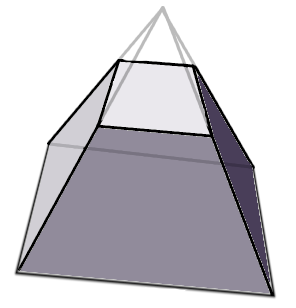

[OpenGL 3D Advanced 2020 第03回]

# 見えないもの描くべからず

## 習得目標

* 視錐台との衝突判定

## 1. 見える範囲だけを描く

### 1.1 頂点シェーダも忙しい

ゲームには多くの物体が存在します。それらの物体を画面に表示するには、モデルデータをグラフィックス・パイプラインに送り込めばよいのでした。

グラフィックス・パイプラインは送り込まれたデータのうち、裏を向いているもの、画面外にあるものを除外し、画面に映るものだけを描画します。ピクセルシェーダは画面外のモデルを全く描画しません。

しかし、頂点シェーダのほうは、画面内に映るかどうかに関わらず、すべての頂点データを処理しなければなりません。なぜなら、ある頂点が画面内に映るかどうかは、実際に座標変換をしてみるまでは分からないからです。

<p align="center">
<br>
[赤い台形が見えている範囲]
</p>

実際のゲームでは、一度に画面に映る物体の数は、シーン全体の`1/100`から`1/10000`に及びます。つまり、頂点シェーダは画面に表示されるモデルの数の、100倍から1万倍の見えないモデルデータを処理していることになります。

これは明らかにGPUパワーの無駄づかいです。

### 1.2 <ruby>視錐台<rt>しすいだい</rt></ruby>

そこで、全く画面に映らないと分かっている物体については、モデルデータを送り込まないようにしようと思います。そうすれば、頂点シェーダに無駄な計算をさせなくて済みます。

<p align="center">
&nbsp;→&nbsp;
<br>
[台形に衝突している物体だけを描画する]
</p>

そのためには、「見えている範囲」を判定できるようにしなくてはなりません。

ある点に視点があるとして、そこから見える範囲は、視点に近いほど狭く、遠いほど広くなります。また、現実の世界では、視点に密着するほど近くにあるものと、星々のようにあまりに遠くにあるものの両方が目に映ります。

<p align="center">

</p>

しかし、コンピューターで3Dグラフィックスを描画する場合、視点に近すぎる、または遠すぎる物体を現実のように扱うことはできません。

それは、コンピューターで表現できる数値には限界があるからです。そのため、近すぎる、または遠すぎる物体を無理に表示しようとすると、物体の位置を正確に扱えなくなってしまいます。

例えばGPUの扱える数値が`0`～`10000`だったとしましょう。物体が`100m`までの範囲に収まっている場合、数値を均等に分けるならば`1cm`単位で距離を記録できます。しかし、もし物体が`1000m`の位置にも存在するとしたらどうでしょう。

`1000m(1km)`の位置を記録できるようにすると、`10cm`単位でしか距離を記録できません。これは、`51cm`の距離にある物体と`58cm`にある物体では、どちらが手前にあるのか分からないということです。もっと遠く、`10000m(10km)`まで記録しようとすると、`1m`単位でしか距離を記録できないのです。

精度の不足は近い距離でも起こります。なぜなら、近くにあるものは大きく表示されるため、わずかな位置の違いが大きな違いとなって現れるからです。

「針の穴に糸を通す」というような映像を表現したい場合、`1cm`どころか`1mm`以下の単位で見分けられなければ困ります。ところが、数値の範囲が`0`～`10000`の場合、`1mm`を見分けられるようにするには`10m`先までしか距離を表せなくなってしまいます。

このように、GPUで表現できる精度には限界があります。そのため、「近すぎる、または遠すぎる物体は描画しない」とするのが一般的です。結果として、実際に描画される範囲は「視点を頂点とする<ruby>四角錐台<rt>しかくすいだい</rt></ruby>」になります。

この「視点を頂点とする四角錐台」のことを、日本語では「視錐台(しすいだい)」、英語では`View frustum`(ビュー・フラスタム)といいます(`frustum`は「<ruby>錘台<rt>すいだい</rt></ruby>」という意味です)。

<p align="center">
<br>
[四角錐台]
</p>

ある物体が画面に映るかどうかは、「物体と視錐台が衝突しているか」と言い換えることができます。衝突判定ができたら、あとは衝突した物体だけを描画するように変更するだけです。

### 1.3 Camera構造体をファイルに分離する

視錐台の位置や向きは、視点の情報から作成します。支店の情報というのは、`Camera`構造体のデータなんですが、現在その`Camera`構造体は`MainGameScene`クラスの中で定義されています。そのため、他のクラスからは参照できません。

そこで、まずは`Camera`構造体を独立したファイルに分離し、他のファイルからも参照できるようにします。ソリューションエクスプローラーの`ソースファイル`フィルタを右クリックし、「追加→新しい項目」の順で選択して「新しい項目の追加」ウィンドウを表示してください。

ウィンドウが開いたら、プロジェクトの`Src`フォルダに`Camera.h`というヘッダファイルを追加してください。追加した`Camera.h`を開き、次のプログラムを追加してください。

```diff
+/**
+* @file Camera.h
+*/
+#ifndef CAMERA_H_INCLUDED
+#define CAMERA_H_INCLUDED
+#include <GL/glew.h>
+#include <glm/glm.hpp>
+// windows.hが定義しているnear,farマクロを無効化.
+#undef far
+#undef near
+
+#endif // CAMERA_H_INCLUDED
```

ヘッダファイルを追加したら、同じ手順で、プロジェクトの`Src`フォルダに`Camera.cpp`というソースファイルを追加してください。追加した`Camera.cpp`を開き、次のプログラムを追加してください。

```diff
+/**
+* @file Camera.cpp
+*/
+#include "Camera.h"
```

それでは`Camera`構造体を移動しましょう。まず`MainGameScene.h`を開き、次のように`Camera.h`をインクルードしてください。

```diff
 #include "Light.h"
 #include "FrameBufferObject.h"
 #include "Particle.h"
 #include "TextWindow.h"
+#include "Camera.h"
 #include <random>
 #include <vector>
```

次に、`Ctrl+X`を使って`MainGameScene`クラスの定義から`Camera`構造体の定義を切り取ります。

```diff
   Font::Renderer fontRenderer;
   Mesh::Buffer meshBuffer;
   Terrain::HeightMap heightMap;
-
-  struct Camera {
-    glm::vec3 target = glm::vec3(100, 0, 100);
-    glm::vec3 position = glm::vec3(100, 50, 150);
-         ・
-         ・
-         ・
-    float focalPlane = 10000.0f; ///< フォーカル・プレーン = ピントの合う距離.
-
-    void Update(const glm::mat4& matView);
-  };

   PlayerActorPtr player;
   ActorList enemies;
```

`Camera.h`を開き、`Ctrl+V`を使って、次のように切り取った`Camera`構造体を貼り付けてください。

```diff
 // windows.hが定義しているnear,farマクロを無効化.
 #undef far
 #undef near
+
+struct Camera {
+  glm::vec3 target = glm::vec3(100, 0, 100);
+  glm::vec3 position = glm::vec3(100, 50, 150);
+       ・
+       ・
+       ・
+  float focalPlane = 10000.0f; ///< フォーカル・プレーン = ピントの合う距離.
+
+  void Update(const glm::mat4& matView);
+};

 #endif // CAMERA_H_INCLUDED
```

`Camera`構造体が何を表すものなのかは、名前からもメンバ変数からも明らかではあります。でも、まあ、一応の説明は書いておくべきでしょう。貼り付けた`Camera`構造体の定義の先頭に、次のプログラムを追加してください。

```diff
 // windows.hが定義しているnear,farマクロを無効化.
 #undef far
 #undef near

+/**
+* カメラを表す構造体.
+*/
 struct Camera {
   glm::vec3 target = glm::vec3(100, 0, 100);
   glm::vec3 position = glm::vec3(100, 50, 150);
```

これで構造体の定義を移動することができました。

### 1.4 Camera::Update関数を移動する

構造体の定義は移動しましたが、まだ`Update`メンバ関数の定義は`MainGameScene.cpp`に残っています。このメンバ関数も移動しましょう。`MainGameScene.cpp`を開き、`Ctrl+X`を使って`Camera::Update`関数の定義を切り取ってください。

```diff
     enemies.Add(p);
   }
   return true;
  }
-
-/**
-* カメラのパラメータを更新する.
-*
-* @param matView 更新に使用するビュー行列.
-*/
-void MainGameScene::Camera::Update(const glm::mat4& matView)
-{
-  const glm::vec4 pos = matView * glm::vec4(target, 1);```
-  focalPlane = pos.z * -1000.0f;
-
-  const float imageDistance = sensorSize * 0.5f / glm::tan(fov * 0.5f);
-  focalLength = 1.0f / ((1.0f / focalPlane) + (1.0f / imageDistance));
-
-  aperture = focalLength / fNumber;
-}
```

次に、`Camera.cpp`を開き、切り取った`Update`メンバ関数を`Ctrl+V`を使って貼り付けてください。

```diff
 /**
 * @file Camera.cpp
 */
 #include "Camera.h"
+
+/**
+* カメラのパラメータを更新する.
+*
+* @param matView 更新に使用するビュー行列.
+*/
+void MainGameScene::Camera::Update(const glm::mat4& matView)
+{
+  const glm::vec4 pos = matView * glm::vec4(target, 1);```
+  focalPlane = pos.z * -1000.0f;
+
+  const float imageDistance = sensorSize * 0.5f / glm::tan(fov * 0.5f);
+  focalLength = 1.0f / ((1.0f / focalPlane) + (1.0f / imageDistance));
+
+  aperture = focalLength / fNumber;
+}
```

今の`Camera`構造体は`MainGameScene`クラスのメンバではないので、`MainGameScene::`を取り除く必要があります。上記のプログラムを次のように変更してください。

```diff
 * カメラのパラメータを更新する.
 *
 * @param matView 更新に使用するビュー行列.
 */
-void MainGameScene::Camera::Update(const glm::mat4& matView)
+void Camera::Update(const glm::mat4& matView)
 {
   const glm::vec4 pos = matView * glm::vec4(target, 1);```
   focalPlane = pos.z * -1000.0f;
```

これで`Camera`構造体の移動は完了です。

### 1.5 fovの設定ミスを修正する

申し訳ないことに、以前音プログラムが一部間違っていたことが判明したので、修正していきます。具体的には「`Camera`構造体の`fov`メンバ変数の数値が2倍になっていた」というものです。

まず`Camera.h`を開き、`fov`メンバ変数を次のように変更してください。

```diff
   // 変更可能なカメラパラメータ.
   float fNumber = 1.4f; ///< エフ・ナンバー = カメラのF値.
-  float fov = glm::radians(60.0f); ///< フィールド・オブ・ビュー = カメラの視野角(ラジアン)
+  float fov = glm::radians(30.0f); ///< フィールド・オブ・ビュー = カメラの視野角(ラジアン)
   float sensorSize = 36.0f; ///< センサー・サイズ = カメラのセンサーの横幅(ミリ).

   // Update関数で計算するカメラパラメータ.
```

次に`MainGameScene.cpp`を開き、`MainGameScene::Render`メンバ関数の`matProj`変数の計算を、次のように変更してください。

```diff
   const float aspectRatio =
     static_cast<float>(window.Width()) / static_cast<float>(window.Height());
   const glm::mat4 matProj =
-    glm::perspective(camera.fov * 0.5f, aspectRatio, camera.near, camera.far);
+    glm::perspective(camera.fov, aspectRatio, camera.near, camera.far);
   meshBuffer.SetViewProjectionMatrix(matProj * matView);
   meshBuffer.SetCameraPosition(camera.position);```
```

誤って`fov`を2倍にしていたので、ここで1/2倍して<ruby>辻褄<rt>つじつま</rt></ruby>を合わせていたのです。本当は全く必要のないことでした。

これで間違っていた部分の修正は完了です。

### 1.6 視錐台を定義する

それでは、視錐台のプログラムに戻りましょう。まずは`Collision.h`で`Camera`構造体を使えるようにします。`Collision.h`を開き、`Camera.h`をインクルードしてください。

```diff
 #ifndef COLLISION_H_INCLUDED
 #define COLLISION_H_INCLUDED
 #include <GL/glew.h>
+#include "Camera.h"
 #include <glm/glm.hpp>

 namespace Collision {
```

視錐台は6つの平面から構成されています。そこで、まず「平面」を定義し、視錐台は「平面6個の配列」として定義することにします。平面を定義する方法はいくつかありますが。今回は交差判定に使いやすい「平面上の1点と法線」による定義を使います。

なお、`Collision.h`における型の定義順は、おおよそ図形の複雑さの順番になっています。そして、平面は線分よりは複雑です。しかしカプセルほどではないので、線分とカプセルの間に定義を追加することにしましょう。

線分の定義の下に次のプログラムを追加してください。平面の型名は`Plane`(プレーン)とします。

```diff
   glm::vec3 a = glm::vec3(0); ///< 線分の始点.
   glm::vec3 b = glm::vec3(0); ///< 線分の終点.
 };
+
+/**
+* 平面.
+*/
+struct Plane
+{
+  glm::vec3 p; ///< 平面上の点.
+  glm::vec3 n; ///< 平面の法線.
+};

 /**
 * カプセル.
 */
```

この`Plane`型を使って錘台を定義しましょう。錘台の型名は`Frustum`(フラスタム)とします。現在`Collision.h`に定義されている最も複雑な図形は`OBB`です。しかし、錘台は`OBB`より複雑な形状です。ということで、`OBB`の定義の下に次のプログラムを追加してください。

```diff
   glm::vec3 axis[3] = { {1,0,0}, {0,1,0}, {0,0,1} }; ///< ボックスの軸.
   glm::vec3 e = glm::vec3(0); ///< 各軸の半径.
 };
+
+/**
+* 錐台.
+*/
+struct Frustum
+{
+  enum {
+    nearPlane,   // 手前の面
+    farPlane,    // 奥の面
+    topPlane,    // 上面
+    bottomPlane, // 下面
+    leftPlane,   // 左面
+    rightPlane,  // 右面
+  };
+  Plane planes[6];
+};

 /**
 * 汎用衝突形状.
```

`nearPlane`(ニア・プレーン)や`rightPlane`(ライト・プレーン)などの列挙値は、配列の何番目がどの面を指しているかを明確にするためのものです。

### 1.7 Frustum型を作成する

`Frustum`を作成する関数を追加しましょう。関数名は`CreateFrustum`(クリエイト・フラスタム)とします。`CreateOBB`関数の宣言の下に、次のプログラムを追加してください。

```diff
 // 形状作成関数.
 Shape CreateSphere(const glm::vec3&, float);
 Shape CreateCapsule(const glm::vec3&, const glm::vec3&, float);
 Shape CreateOBB(const glm::vec3& center, const glm::vec3& axisX,
   const glm::vec3& axisY, const glm::vec3& axisZ, const glm::vec3& e);
+Frustum CreateFrustum(const Camera&);

 /**
 * 衝突結果を表す構造体.
```

続いて`CreateFrustum`関数の定義を書きます。`Collision.cpp`を開き、`CreateOBB`関数の定義の下に、次のプログラムを追加してください。

```diff
     { normalize(axisX), normalize(axisY), normalize(axisZ) }, e };
   return result;
 }
+
+/**
+* 錘台を作成する.
+*
+* @param camera 錘台の元になるカメラオブジェクト.
+*/
+Frustum CreateFrustum(const Camera& camera)
+{
+  // 錘台のXYZ軸を計算.
+  const glm::vec3 axisZ = glm::normalize(camera.target - camera.position);
+  const glm::vec3 axisX = glm::normalize(glm::cross(axisZ, camera.up));
+  const glm::vec3 axisY = glm::normalize(glm::cross(axisX, axisZ));
+
+  // ニア平面の中心(nc)とファー平面の中心(fc)を計算.
+  const glm::vec3 nc = camera.position + axisZ * camera.near;
+  const glm::vec3 fc = camera.position + axisZ * camera.far;
+
+  // ニア平面とファー平面を作成.
+  Frustum frustum;
+  frustum.planes[Frustum::nearPlane] = Plane{ nc, axisZ };
+  frustum.planes[Frustum::farPlane] = Plane{ fc, -axisZ };
+
+  // 上下左右の平面を作成するため、ニア平面の高さ(nh)と幅(nw)を計算.
+  const float tanY = std::tan(camera.fov * 0.5f);
+  const float nh = camera.near * tanY;
+  const float nw = nh * (camera.width / camera.height);
+
+  // 上の平面を作成.
+  glm::vec3 aux = glm::normalize((nc + axisY * nh) - camera.position);
+  frustum.planes[Frustum::topPlane] =
+    Plane{ nc + axisY * nh, glm::normalize(glm::cross(aux, axisX)) };
+
+  // 下の平面を作成.
+  aux = glm::normalize((nc - axisY * nh) - camera.position);
+  frustum.planes[Frustum::bottomPlane] =
+    Plane{ nc - axisY * nh, glm::normalize(glm::cross(axisX, aux)) };
+
+  // 左の平面を作成.
+  aux = glm::normalize((nc - axisX * nw) - camera.position);
+  frustum.planes[Frustum::leftPlane] =
+    Plane{ nc - axisX * nw, glm::normalize(glm::cross(aux, axisY)) };
+
+  // 右の平面を作成.
+  aux = glm::normalize((nc + axisX * nw) - camera.position);
+  frustum.planes[Frustum::rightPlane] =
+    Plane{ nc + axisX * nw, glm::normalize(glm::cross(axisY, aux)) };
+
+  return frustum;
+}

 /**
 * 球と球が衝突しているか調べる.
```

<p align="center">

</p>

平面の法線は外積によって計算します。2つのベクトルの外積を計算すると、2つのベクトルが作る平面と直角なベクトルが得られる、という性質を使います。外積は`glm::cross`(ジーエルエム・クロス)関数で行います。

### 1.8 錘台の衝突判定を作成する

続いて衝突を判定する関数を定義します。関数名は`Test`とします。`Collision.h`を開き、`TestShapeShape`関数の宣言の下に、次のプログラムを追加してください。

```diff
 bool TestSphereOBB(const Sphere& s, const OrientedBoundingBox& obb, glm::vec3* p);
 bool TestShapeShape(const Shape&, const Shape&, glm::vec3* pa, glm::vec3* pb);
 Result TestShapeShape(const Shape&, const Shape&);
+bool Test(const Frustum&, const glm::vec3&);

 glm::vec3 ClosestPointSegment(const Segment& seg, const glm::vec3& p);

 } // namespace Collision
```

続いて定義を作成します。`Collision.cpp`を開き、`TestShapeShape`関数の定義の下に、次のプログラムを追加してください。

```diff
   }
   return Result{};
 }

+
+/**
+* 錘台と点が衝突しているか調べる.
+*
+* @param frustum 錘台.
+* @param point   点.
+*
+* @retval true  衝突している.
+* @retval false 衝突していない.
+*/
+bool Test(const Frustum& frustum, const glm::vec3& point)
+{
+  for (const auto& e : frustum.planes) {
+    const glm::vec3 v(point - e.p);
+    const float d = glm::dot(v, e.n);
+    if (d < 0) {
+      return false;
+    }
+  }
+  return true;
+}

 } // namespace Collision
```

錘台の衝突判定は簡単です。まず、内積によって、点`point`と平面上の任意の点`e.p`の間の距離を法線方向`e.n`に射影します。射影した長さがマイナスならば点は錘台の外側なので、`false`を返して終了します。6つの面の全てでこの判定を行い、結果が全てプラスならば点は錘台の中にあります。

「見える物体だけを描画する」という目的のためには「衝突の有無」が分かれば十分です。ですから、上記の`Test`関数では「衝突位置」や「衝突面の法線」の計算をしていせん。

これで`Frustum`型のプログラムは完成です。

<div style="page-break-after: always"></div>

## 2. Frustum型を使う

### 2.1 ActorList::Drawに視錐台の衝突判定を追加する

作成した`Frustum`型と`Test`関数を使って、描画しなくてはならない物体を見分けましょう。

物体の位置は、現在のプログラムにおいては`Actor`クラスの`position`メンバ変数によって表されています。つまり以下のようなプログラムを書けばよいわけです。

>```c++
>// 視錐台の中にある場合は描画.
>if (Collision::Test(viewFrustum, anyActor.position)) {
>  anyActor.Draw();
>}
>```

単独の`Actor`は個別に上記のやりかたをすればO.K.です。一方、`ActorList`クラスはそういうわけにはいかず、`Frustum`型に対応した`Draw`メンバ関数を追加しなくてはなりません。`Actor.h`を開き、`ActorList`クラスに次のプログラムを追加してください。

```diff
   void Update(float);
   void UpdateDrawData(float);
   void Draw(Mesh::DrawType = Mesh::DrawType::color);
+  void Draw(const Collision::Frustum& frustum, Mesh::DrawType = Mesh::DrawType::color);
   bool Empty() const { return actors.empty(); }

   // イテレーターを取得する関数.
```

次に`Actor.cpp`を開き、既存の`Actor::Draw`メンバ関数の定義の下に、次のプログラムを追加してください。

```diff
       e->Draw(drawType);
     }
   }
 }
+
+/**
+* Actorを描画する.
+*
+* @param frustum  視錐台.
+* @param drawType 描画するデータの種類.
+*/
+void ActorList::Draw(const Collision::Frustum& frustum, Mesh::DrawType drawType)
+{
+  for (const ActorPtr& e : actors) {
+    if (e && e->health > 0) {
+      if (Collision::Test(frustum, e->position)) {
+        e->Draw(drawType);
+      }
+    }
+  }
+}

 /**
 * 指定された座標の近傍にあるアクターのリストを取得する.
```

`Frustum`型に対応した`Draw`メンバ関数は、`Collision::Test`関数が`true`を返した場合、つまり衝突が発生した場合のみ`Actor::Draw`メンバ関数を呼び出すようになっています。

### 2.2 MainGameScene::RenderMesh`メンバ関数を視錐台に対応させる

現在、`MainGameScene`クラスの描画処理は`RenderMesh`メンバ関数で行っています。この関数を`Frustum`型に対応させます。`MainGameScene.h`を開き、`RenderMesh`メンバ関数の宣言を次のように変更してください。

```diff
   bool HandleJizoEffects(int id, const glm::vec3& pos);
 private:
-  void RenderMesh(Mesh::DrawType);
+  void RenderMesh(const Collision::Frustum*, Mesh::DrawType);

   std::mt19937 rand;
   int jizoId = -1; ///< 現在戦闘中のお地蔵様のID.
```

続いて定義も修正します。`MainGameScene.cpp`を開き、`RenderMesh`関数の定義を次のように変更してください。

```diff
 * @param drawType 描画するデータの種類.
 */
-void MainGameScene::RenderMesh(Mesh::DrawType drawType)
+void MainGameScene::RenderMesh(const Collision::Frustum* pFrustum, Mesh::DrawType drawType)
 {
   glm::vec3 cubePos(100, 0, 100);
   cubePos.y = heightMap.Height(cubePos);
```

それから、`Draw`メンバ関数呼び出しに`pFrustum`を指定します。ただし、現状ではシャドウ用の視錐台を作成するプログラムがないので

```diff
   Mesh::Draw(meshBuffer.GetFile("Cube"), matModel, drawType);
   Mesh::Draw(meshBuffer.GetFile("Terrain"), glm::mat4(1), drawType);
+
+  if (pFrustum) {
+    if (Collision::Test(*pFrustum, player->position)) {
+      player->Draw(drawType);
+    }
+    enemies.Draw(*pFrustum, drawType);
+    trees.Draw(*pFrustum, drawType);
+    objects.Draw(*pFrustum, drawType);
+  } else {
     player->Draw(drawType);
     enemies.Draw(drawType);
     trees.Draw(drawType);
     objects.Draw(drawType);
+  }
   glm::vec3 treePos(110, 0, 110);
   treePos.y = heightMap.Height(treePos);
```

これで関数の変更は完了です。続いて`RenderMesh`を呼び出しているプログラムを変更します。`MainGameScene::Render`関数の影用`FBO`に描画しているプログラムを、次のように変更してください。

```diff
     // ビュー・プロジェクション行列を設定してメッシュを描画.
     meshBuffer.SetShadowViewProjectionMatrix(matProj * matView);
-    RenderMesh(Mesh::DrawType::shadow);
+    RenderMesh(nullptr, Mesh::DrawType::shadow);
   }
```

現在のところ、影の描画は視錐台に対応していないので、`nullptr`を指定します。

`RenderMesh`の呼び出しはもう一箇所あります。通常の`FBO`に描画しているプログラムを、次のように変更してください。

```diff
   meshBuffer.SetTime(window.Time());
   meshBuffer.BindShadowTexture(fboShadow->GetDepthTexture());
-  RenderMesh(Mesh::DrawType::color);
+  const Collision::Frustum viewFrustum = Collision::CreateFrustum(camera);
+  RenderMesh(&viewFrustum, Mesh::DrawType::color);
   particleSystem.Draw(matProj, matView);
   meshBuffer.UnbindShadowTexture();
```

これで視錐台カリングが行われるはずです。プログラムが書けたらビルドして実行してください。木や壁、地蔵などの物体が、画面端に寄ると消えるようになっていたら、視錐台カリングは正常に動作しています。

### 2.3 画面端で消えないようにする

いくら無駄な描画が減らせるといっても、画面端で消えてしまうのはちょっとやりすぎですね。これは、物体の一点でしか衝突判定をしていないのが原因です。

ほとんどの物体は点ではなく、ある程度の大きさを持ちます。そのため、物体の座標が視錐台に衝突していない場合でも、物体の一部は画面内に存在する可能性があるのです。

そこで、球を使って「その物体が表示される大きさ」を表現し、視錐台と球の衝突判定を行うことで、視錐台判定を改善しましょう。

`Collision.h`を開き、`Test`関数の宣言の下に、次のプログラムを追加してください。

```diff
 bool TestShapeShape(const Shape&, const Shape&, glm::vec3* pa, glm::vec3* pb);
 Result TestShapeShape(const Shape&, const Shape&);
 bool Test(const Frustum&, const glm::vec3&);
+bool Test(const Frustum&, const Sphere&);

 glm::vec3 ClosestPointSegment(const Segment& seg, const glm::vec3& p);

 } // namespace Collision
```

次に`Collision.cpp`を開き、`Test`関数の定義の下に、次のプログラムを追加してください。

```diff
   }
   return true;
 }
+
+/**
+* 錘台と球が衝突しているか調べる.
+*
+* @param frustum 錘台.
+* @param sphere  球.
+*
+* @retval true  衝突している.
+* @retval false 衝突していない.
+*
+* 補足: 辺領域、頂点領域で、衝突していないのに衝突したと判定する場合がある.
+*/
+bool Test(const Frustum& frustum, const Sphere& sphere)
+{
+  for (const auto& e : frustum.planes) {
+    const glm::vec3 v(sphere.center - e.p);
+    const float d = glm::dot(v, e.n);
+    if (d < -sphere.r) {
+      return false;
+    }
+  }
+  return true;
+}

 } // namespace Collision
```

点の衝突判定との違いは、射影した距離`d`が球の半径をマイナスにしたものより小さいかどうかを調べているところです。要するに視錐台を球の半径だけ大きくし、点との判定を行っているわけです。

>**【拡大した錘台の正確性】**
>厳密には、この「マイナスの半径」による判定方法は「実際には衝突していないのに衝突したと判定する」可能性があります。正確な判定を行うにはより多くの計算が必要になりますが、それによって減らせる描画コストはごくわずかで、増えた計算量と釣り合わないことが多いです。ですから、上記のプログラムでは、多少の誤判定があったとしても計算の簡単な方法を採用しました。

### 2.4 視錐台用の諸凸判定形状を追加する

次に`Actor`クラスに、視錐台との衝突判定用の球データを追加します。メンバ変数名は`bounds`(バウンズ)とします(「バウンズ」は「境界」という意味)。`Actor.h`を開き、`Actor`クラスの定義に次のプログラムを追加してください。

```diff
   int health = 0; ///< 体力.
   Collision::Shape colLocal;
   Collision::Shape colWorld;
+
+  // 視錐台判定用の衝突形状.
+  Collision::Sphere bounds = Collision::Sphere{ glm::vec3(0), 0 };
 };
 using ActorPtr = std::shared_ptr<Actor>;
```

`bounds`(バウンズ)に値を設定するのは`Actor::Update`メンバ関数で行うのがよいでしょう。`Actor.cpp`を開き、`Actor::Update`メンバ関数を次のように変更してください。

```diff
   case Collision::Shape::Type::sphere:
     colWorld.s.center = matModel * glm::vec4(colLocal.s.center, 1);
     colWorld.s.r = colLocal.s.r;
+
+    // 視錐台用衝突判定を更新.
+    bounds = colWorld.s;
+    bounds.r *= 1.1f;
     break;

   case Collision::Shape::Type::capsule:
     colWorld.c.seg.a = matModel * glm::vec4(colLocal.c.seg.a, 1);
     colWorld.c.seg.b = matModel * glm::vec4(colLocal.c.seg.b, 1);
     colWorld.c.r = colLocal.c.r;
+
+    // 視錐台用衝突判定を更新.
+    bounds.center = (colWorld.c.seg.a + colWorld.c.seg.b) * 0.5f;
+    bounds.r = colWorld.c.r +
+      glm::length(colWorld.c.seg.b - colWorld.c.seg.a) * 0.5f;
+    bounds.r *= 1.1f;
     break;

   case Collision::Shape::Type::obb:
     colWorld.obb.center = matModel * glm::vec4(colLocal.obb.center, 1);
     for (size_t i = 0; i < 3; ++i) {
       colWorld.obb.axis[i] = matR_XZY * glm::vec4(colLocal.obb.axis[i], 1);
     }
     colWorld.obb.e = colLocal.obb.e;
+
+    // 視錐台用衝突判定を更新.
+    bounds.center = colWorld.obb.center;
+    bounds.r = glm::length(colWorld.obb.e);
+    bounds.r *= 1.1f;
     break;
   }
```

視錐台用の衝突判定形状`bounds`は、通常の衝突判定形状がすっぽり収まる大きさの球の、半径を`1.1`倍したものとしました。

「通常の衝突判定形状」が物体の形状を十分よく表しているかぎり、「すっぽり収まる大きさの球」は十分に機能します。しかし、物体の実際の形状が衝突判定形状よりも大きい、ということは十分に考えられます。半径を`1.1`倍しているのは、その可能性を考慮するためです。

`Update`メンバ関数で`bounds`を更新することにした理由は、`bounds`メンバ変数が自動的に更新されるようにしたかったからです。これによって、通常の衝突判定形状が変化すると、それは自動的に`bounds`に反映されます。

### 2.5 ActorList::Draw関数を球データに対応させる

最後に`ActorList::Draw`メンバ関数を球データに対応させましょう。`Actor.cpp`を開き、`ActorList::Draw`メンバ関数を次のように変更してください。

```diff
 void ActorList::Draw(const Collision::Frustum& frustum, Mesh::DrawType drawType)
 {
   for (const ActorPtr& e : actors) {
     if (e && e->health > 0) {
-      if (Collision::Test(frustum, e->position)) {
+      if (Collision::Test(frustum, e->bounds)) {
         e->Draw(drawType);
       }
     }
   }
 }
```

プログラムが書けたらビルドして実行してください。物体が画面端に行っても突然消えたりしなければ成功です。

>**【視錐台をもっと広範囲に使う】**<br>
>テキストでは、視錐台を使ったのは通常の描画だけでした。しかし、パーティクルの描画や影の描画に視錐台による描画判定を追加することは可能です。興味があれば挑戦してみてください。
