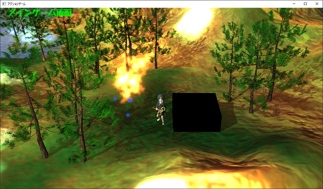
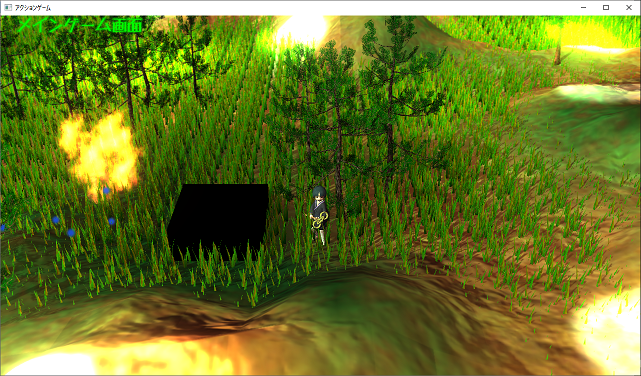
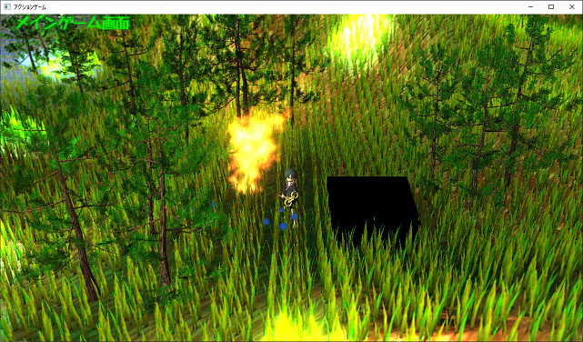
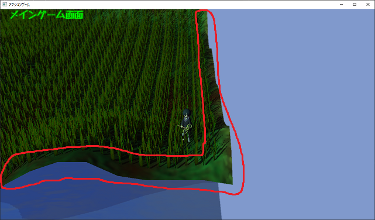
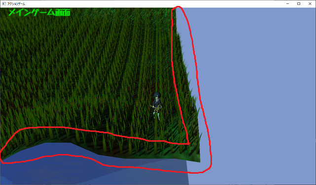
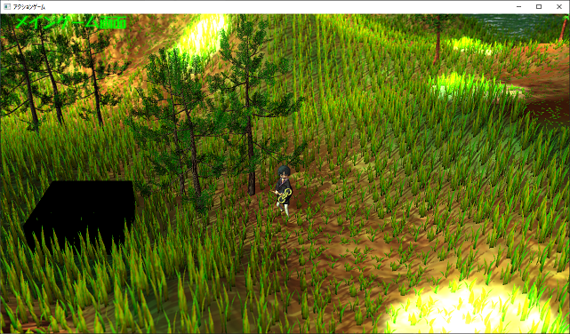
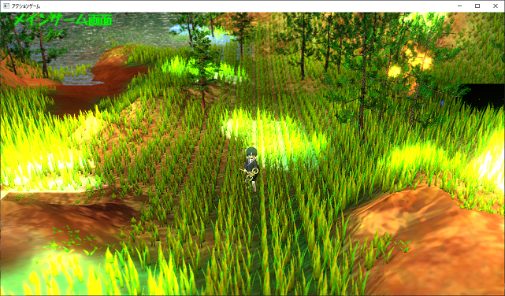

[OpenGL 3D Advanced 2020 第04回]

# 草生える

## 習得目標

* インスタンス描画の扱い方

## 1. インスタンシング

### 1.1 同じモデルを大量に描くには

今回は地面に植物を生やしてみようと思います。現在の地形は`199x199m`で、`1x1m`単位で分割されています。1単位ごとに草を生やすとすると、地形全体に植物を生やすためには約4万本も生やさねばなりません。

以前に木を1000本ほど植えたとき、非常に処理に時間がかかるようになったことを覚えているでしょうか。草の数はその40倍ですから、木の場合を大きく超える負荷がかかることが想像できます。

<pre class="tnmai_assignment">
<strong>【課題01】</strong>
<code>RenderMesh</code>関数の先頭に、地面の1マスごとにひとつ、全部で<code>199x199</code>個の草を表示するプログラムを追加しなさい。草のglTF及びTGAファイルには
<code>https://github.com/tn-mai/OpenGL3D2020_Advanced/tree/master/Res</code>にある
<code>grass.gltf</code>、<code>grass.bin</code>、<code>grass.tga</code>を使いなさい。
草の本数が多いため、表示には非常に時間がかかります。
</pre>

課題01によって分かることは「`glDrawElements`によって大量の草を生やすのは難しい」ということです。そこで、別の描画方法を考えます。

### 1.2 Mesh::Draw関数をインスタンシングに対応させる

実はOpenGLには「同じモデルを大量に描画する機能」が存在します。それが「インスタンシング」です。

「インスタンシング」を使うと、数千、数万ものモデルを非常に高速に表示することができます。使い方はとても簡単で、`glDrawElementsBaseVertex` を `glDrawElementsInstancedBaseVertex` (ジーエル・ドロー・エレメンツ・インスタンスド・ベース・バーッテックス)に置き換えるだけです。

まず`glDrawElementsInstancedBaseVertex`を使って、`Mesh::Draw`関数をインスタンシングに対応させましょう。`Mesh.h`を開き、`Draw`関数の宣言を次のように変更してください。

```diff
 enum class DrawType {
   color,
   shadow,
 };
-void Draw(const FilePtr&, const glm::mat4& matM, DrawType = DrawType::color);
+void Draw(const FilePtr&, const glm::mat4& matM, DrawType = DrawType::color,
+  size_t instanceCount = 1);

 } // namespace Mesh

 #endif // MESH_H_INCLUDED
```

新たに追加した`instanceCount`(インスタンス・カウント)引数は、描画する

次に、`Mesh.cpp`を開き、`Draw`関数の定義の先頭を次のように変更してください。

```diff
 * @param matM          描画に使用するモデル行列.
 * @param type          描画するシェーダの種類.
+* @param instanceCount 描画するインスタンス数.
 */
-void Draw(const FilePtr& file, const glm::mat4& matM, DrawType type)
+void Draw(const FilePtr& file, const glm::mat4& matM, DrawType type,
+  size_t instanceCount)
 {
   if (!file || file->meshes.empty() || file->materials.empty()) {
     return;
```

さらに、同じく`Draw`関数の`glDrawElementsBaseVertex`関数呼び出しを、次のように変更してください。

```diff
       if (const GLenum error = glGetError()) {
         std::cout << "[エラー]" << std::hex << error << "\n";
       }

+      if (instanceCount > 1) {
+        glDrawElementsInstancedBaseVertex(
+          p.mode, p.count, p.type, p.indices, instanceCount, p.baseVertex);
+      } else {
         glDrawElementsBaseVertex(p.mode, p.count, p.type, p.indices, p.baseVertex);
+      }
       p.vao->Unbind();
     }
   }
```

この変更によって、`instanceCount`が2以上の場合は`glDrawElementsInstancedBaseVertex`関数を使ってインスタンシングが行えるようになりました。

さて、`課題01`で作成してもらったプログラムは、変数名などの細部は異なるとしても、おおよそ以下のようなものだと思います。

>```c++
>void MainGameScene::RenderMesh(Mesh::DrawType drawType,
>  const Collision::Frustum* pFrustum)
>{
>  glEnable(GL_CULL_FACE);
>  glCullFace(GL_BACK);
>  // 課題01の答え.
>  for (int z = 0; z < 199; ++z) {
>    for (int x = 0; x < 199; ++x) {
>      glm::vec3  pos(x, 0, z);
>      pos.y = heightMap.Height(pos);
>      const glm::mat4 matModel = glm::translate(glm::mat4(1), pos);
>      Mesh::Draw(meshBuffer.GetFile("Res/grass.gltf"), matModel, drawType);
>    }
>  }
>```

これをきっぱりと消して、次のように書き変えてください。

```diff
 void MainGameScene::RenderMesh(Mesh::DrawType drawType,
   const Collision::Frustum* pFrustum)
 {
   glEnable(GL_CULL_FACE);
   glCullFace(GL_BACK);
-  for (int z = 0; z < 199; ++z) {
-    for (int x = 0; x < 199; ++x) {
-      glm::vec3  pos(x, 0, z);
-      pos.y = heightMap.Height(pos);
-      const glm::mat4 matModel = glm::translate(glm::mat4(1), pos);
-      Mesh::Draw(meshBuffer.GetFile("Res/grass.gltf"), matModel, drawType);
-    }
-  }
+
+  // 草を描画.
+  const glm::vec3 posGrass =
+    glm::vec3(0, heightMap.Height(glm::vec3(100, 0, 100)), 0); // マップ中央の高さに表示.
+  const glm::mat4 matGrass = glm::translate(glm::mat4(1), posGrass)
+  Mesh::Draw(meshBuffer.GetFile("Res/grass.gltf"), matGrass, drawType, 199*199);
+
  glm::vec3 cubePos(100, 0, 100);
  cubePos.y = heightMap.Height(cubePos);
```

このように「インスタンシング」を使うことで、同じモデルの描画を非常に簡潔に書くことができ、また処理も非常に高速になります。

プログラムが書けたらビルドして実行してください。処理が軽くなって、草が表示され…ませんね？

<p align="center">
<br>
</p>

### 1.3 インスタンシング用の頂点シェーダ

「「置き換えるだけ」と言ったな。あれは嘘だ。」

申し訳ありません。関数を置き換えるだけではなく、インスタンシングに対応したシェーダを使う必要があります。草用のシェーダなので「草シェーダ」と呼びましょう。

草はインスタンシングによって広範囲に表示されますが、個々の草はスタティックメッシュだと考えられます。そのため、`StaticMesh.vert`と`StaticMesh.frag`をコピーして、インスタンシングに対応させるのがよいでしょう。

ということで、まずは頂点シェーダを作成します。プロジェクトの`Res`フォルダに`Grass.vert`というファイルを追加してください。そして、`StaticMesh.vert`のプログラム全体をコピーして、追加した`Grass.vert`に貼り付けてください。

続いて、貼り付けたプログラムをインスタンシングに対応させていきます。まず地形のサイズを表す定数を追加します。`Grass.vert`を開き、`matShadow`ユニフォーム変数の定義の下に、次のプログラムを追加してください。

```diff
 uniform mat4 matMVP;
 uniform mat4 matModel;
 uniform mat4 matShadow;
+
+const ivec2 mapSize = ivec2(200, 200); // マップの大きさ.

 /**
 * Grass vertex shader.
 */
```

インスタンシングによって描画する個々のモデルのことを、「インスタンス」といいます。先に書いたプログラムでは「`199x199`個のインスタンスを描画」しているわけです。

>**【描画する草の数が200x200ではない理由】**<br>
>`200x200`は頂点の数です。草は頂点の間に作られるため、縦横がひとつ少なくなって`199x199`になるのです。

インスタシング描画では、シェーダはインスタンスの数だけ実行されます。「何番目のインスタンスを処理しているか」は`gl_InstanceID`(ジーエル・インスタンス・アイディー)という変数を見れば分かるようになっています。

この`gl_InstanceID`を利用して、草を生やす位置を調整します。具体的には`+X`(プラス・エックス)方向について、`gl_InstanceID`が`1`増えるごとに`1m`ずつずらします。そして`199`個ごと`0m`に戻します。

同様に`+Z`(プラス・ゼット)方向について、`gl_InstanceID`が`199`増えるごとに`1m`ずらします。例えば`gl_InstanceID`が`451`の場合、草を生やす位置は`+X`方向に`51m`、`+Z`方向に`2m`ずらした位置になります。

これを割り算と余りを使って言い換えると、「`+X`方向に`(gl_InstanceID % 199)m`、`+Z`方向に`(gl_InstanceID / 199)m`ずらした位置」となります。

それでは、`outPosition`と`gl_Position`を計算するプログラムを、次のように変更してください。

```diff
   outTexCoord = vTexCoord;
   outNormal = normalize(matNormal * vNormal);
+
+  // 草を生やす位置を計算.
+  float x = float(gl_InstanceID % (mapSize.x - 1));
+  float z = float(gl_InstanceID / (mapSize.y - 1));
+  vec3 instancePosition = vPosition + vec3(x, 0, z);
+
-  outPosition = vec3(matModel * vec4(vPosition, 1.0));
+  outPosition = vec3(matModel * vec4(instancePosition, 1.0));
   outShadowPosition = vec3(matShadow * vec4(outPosition, 1.0)) * 0.5 + 0.5;
   outShadowPosition.z -= 0.0005;
-  gl_Position = matMVP * (matModel * vec4(vPosition, 1.0));
+  gl_Position = matMVP * (matModel * vec4(instancePosition, 1.0));
 }
```

### 1.4 インスタンシング用のフラグメントシェーダ

続いてフラグメントシェーダを作成します。プロジェクトの`Res`フォルダに`Grass.frag`というファイルを追加してください。そして、`StaticMesh.frag`のプログラム全体をコピーして、追加した`Grass.frag`に貼り付けてください。

`StaticMesh.frag`は、アクターの周辺にあるライトを最大8個選び出し、それらを使ってライティングを行います。しかし、インスタンシングではユニフォーム変数を変更できません。そのため、すべての草のインスタンスについて、適切なライトを選ぶことは困難です。

そこで、地形シェーダ(`Terrain.vert`、`Terrain.frag`)で使っている、「ライトインデックスバッファ」を流用しようと思います。

「ライトインデックスバッファ」には、`1x1`mの地形ごとに、その地形に影響するライトの番号が格納されています。インスタンスの頂点座標を「ライトインデックスバッファ」の添え字に使えば、影響するライトの番号を得ることができるはずです。

さっそく、草シェーダを「ライトインデックスバッファ」を使うように書き換えましょう。`Grass.frag`を開き、次のようにライトインデックス変数を「ライトインデックスバッファ」で置き換えてください。

```diff
 out vec4 fragColor;

 uniform sampler2D texColor;

 uniform sampler2DShadow texShadow;
-
-uniform int pointLightCount;
-uniform int pointLightIndex[8];
-
-uniform int spotLightCount;
-uniform int spotLightIndex[8];
+uniform isamplerBuffer texPointLightIndex; // ポイントライトのインデックスバッファ
+uniform isamplerBuffer texSpotLightIndex; // スポットライトのインデックスバッファ
+
+const ivec2 mapSize = ivec2(200, 200); // マップの大きさ

 struct AmbientLight
 {
   vec4 color;
 };
```

続いて、ライトの番号を「ライトインデックスバッファ」から取得するように書き換えます。まずはポイントライトの`for`文を、次のように変更してください。

```diff
   float power = max(dot(normal, -directionalLight.direction.xyz), 0.0);
   lightColor += directionalLight.color.rgb * power * shadow;

+  // ワールド座標から添え字を計算.
+  int offset = int(inPosition.z) * (mapSize.x - 1) + int(inPosition.x);
+
+  // 添え字offsetを使って、ポイントライトのインデックスバッファからライト番号を取得.
+  ivec4 pointLightIndex = texelFetch(texPointLightIndex, offset);
-  for (int i = 0; i < pointLightCount; ++i) {
+  for (int i = 0; i < 4; ++i) {
     int id = pointLightIndex[i];
+    if (id < 0) { // 番号が0未満の場合、それ以上ライト番号は入っていない.
+      break;
+    }
     vec3 lightVector = pointLight[id].position.xyz - inPosition;
     vec3 lightDir = normalize(lightVector);
     float cosTheta = clamp(dot(normal, lightDir), 0.0, 1.0);
```

同様に、スポットライトの`for`文を、次のように変更してください。

```diff
     float intensity = 1.0 / (1.0 + dot(lightVector, lightVector));
     lightColor += pointLight[id].color.rgb * cosTheta * intensity;
   }

+  // 添え字offsetを使って、スポットライトのインデックスバッファからライト番号を取得.
+  ivec4 spotLightIndex = texelFetch(texSpotLightIndex, offset);
-  for (int i = 0; i < spotLightCount; ++i) {
+  for (int i = 0; i < 4; ++i) {
     int id = spotLightIndex[i];
+    if (id < 0) { // 番号が0未満の場合、それ以上ライト番号は入っていない.
+      break;
+    }
     int id = spotLightIndex[i];
     vec3 lightVector = spotLight[id].posAndInnerCutOff.xyz - inPosition;
```

これで、ライティングに「ライトインデックスバッファ」が使われるようになりました。

### 1.5 草シェーダを読み込む

作成した草シェーダを読み込みます。最初にシェーダ管理用の変数を追加しましょう。`Mesh.h`を開き、次のプログラムを追加してください。

```diff
   const Shader::ProgramPtr& GetSkeletalShadowShader() const {
     return progSkeletalShadow; }
+  const Shader::ProgramPtr& GetGrassShader() const { return progGrass; }
+  const Shader::ProgramPtr& GetGrassShadowShader() const { return progGrassShadow; }

 private:
   BufferObject vbo;
   BufferObject ibo;
   GLintptr vboEnd = 0;
   GLintptr iboEnd = 0;
   std::unordered_map<std::string, FilePtr> files;
   Shader::ProgramPtr progStaticMesh;
   Shader::ProgramPtr progTerrain;
   Shader::ProgramPtr progWater;
   Shader::ProgramPtr progShadow;
   Shader::ProgramPtr progNonTexturedShadow;
   Shader::ProgramPtr progSkeletalShadow;
+
+  // 草シェーダ
+  Shader::ProgramPtr progGrass;
+  Shader::ProgramPtr progGrassShadow;

   // スケルタル・アニメーションに対応したシェーダーを保持するメンバ変数.
   Shader::ProgramPtr progSkeletalMesh;
```

次はシェーダを読み込み、シェーダ管理用変数に格納します。`Mesh.cpp`を開き、`Buffer::Init`関数に次のプログラムを追加してください。

```diff
   if (progWater->IsNull()) {
     return false;
   }
+
+  // 草シェーダを読み込む.
+  progGrass = Shader::Program::Create("Res/Grass.vert", "Res/Grass.frag");
+  progGrassShadow = Shader::Program::Create(
+    "Res/Grass.vert", "Res/NoTexturedShadow.frag");
+  if (progGrass->IsNull() || progGrassShadow->IsNull()) {
+    return false;
+  }

   progShadow  = Shader::Program::Create("Res/StaticMesh.vert", "Res/Shadow.frag");
   progNonTexturedShadow  = Shader::Program::Create(
     "Res/StaticMesh.vert", "Res/NonTexturedShadow.frag");
```

<br>

### 1.6 草シェーダにデータを転送できるようにする

新しいシェーダを追加するときは、そのシェーダのユニフォーム変数にもデータが転送されるようにしておくべきです。`Buffer`クラスには、`SetViewProjectionMatirix`を始めとする`4`つのデータ転送関数があります。そのすべてに、草シェーダへデータを転送する能力を追加します。

`Buffer::SetViewProjectionMatrix`関数の定義に、次のプログラムを追加してください。

```diff
   progTerrain->SetViewProjectionMatrix(matVP);
   progWater->Use();
   progWater->SetViewProjectionMatrix(matVP);
+  progGrass->Use();
+  progGrass->SetViewProjectionMatrix(matVP);
   glUseProgram(0);
 }

 /**
 * シェーダに影用のビュー・プロジェクション行列を設定する.
```

`Buffer::SetShadowViewProjectionMatrix`関数の定義に、次のプログラムを追加してください。

```diff
 void Buffer::SetShadowViewProjectionMatrix(const glm::mat4& matVP) const
 {
+  // 影以外のシェーダには影用VP行列として設定.
   progStaticMesh->Use();
   progStaticMesh->SetShadowViewProjectionMatrix(matVP);
   progSkeletalMesh->Use();
   progSkeletalMesh->SetShadowViewProjectionMatrix(matVP);
   progTerrain->Use();
   progTerrain->SetShadowViewProjectionMatrix(matVP);
   progWater->Use();
   progWater->SetShadowViewProjectionMatrix(matVP);
+  progGrass->Use();
+  progGrass->SetShadowViewProjectionMatrix(matVP);
+
+  // 影シェーダには通常のVP行列として設定.
   progShadow->Use();
   progShadow->SetViewProjectionMatrix(matVP);
   progNonTexturedShadow->Use();
   progNonTexturedShadow->SetViewProjectionMatrix(matVP);
   progSkeletalShadow->Use();
   progSkeletalShadow->SetViewProjectionMatrix(matVP);
+  progGrassShadow->Use();
+  progGrassShadow->SetViewProjectionMatrix(matVP);
   glUseProgram(0);
 }
```

`Buffer::SetCameraPosition`関数の定義に、次のプログラムを追加してください。

```diff
   progTerrain->SetCameraPosition(pos);
   progWater->Use();
   progWater->SetCameraPosition(pos);
+  progGrass->Use();
+  progGrass->SetCameraPosition(pos);
   glUseProgram(0);
 }

 /**
 * シェーダーにアプリが起動してからの経過時間を設定する.
```

次が最後のデータ転送関数です。`Buffer::SetTime`関数の定義に、次のプログラムを追加してください。

```diff
   progTerrain->SetTime(ftime);
   progWater->Use();
   progWater->SetTime(ftime);
+  progGrass->Use();
+  progGrass->SetTime(ftime);
   glUseProgram(0);
 }

 /**
 * 影用テクスチャをGLコンテキストに割り当てる.
```

これで、草シェーダのユニフォーム変数に、データが転送されるようになりました。

### 1.7 HeightMapクラスに草メッシュ作成機能を追加する

「ライトインデックスバッファ」は`HeightMap`(ハイトマップ)クラスの管理下にあります。ですから、メッシュが草シェーダを使えるように設定する作業は、ハイトマップクラスで行うのがよいでしょう。

この「草シェーダを設定する」関数の名前は`SetupGrassShader`(セットアップ・グラス・シェーダ)としましょうか。`Terrain.h`を開き、`HeightMap`クラスの定義に次のプログラムを追加してください。

```diff
   bool CreateWaterMesh(Mesh::Buffer& meshBuffer,
     const char* meshName, float waterLevel) const;
+  void SetupGrassShader(const Mesh::Buffer& meshBuffer, const char* meshName) const;
   void UpdateLightIndex(const ActorList& lights);

 private:
   std::string name;                ///< 元になった画像ファイル名.
```

続いて関数定義を行います。`SetupGrassShader`は「シェーダを管理するメッシュバッファ」、「草シェーダの設定先メッシュの名前」という2つの引数を受け取ります。<br>`Terrain.cpp`を開き、`HeightMap::CreateWaterMesh`関数の定義の下に、次のプログラムを追加してください。

```diff
   meshBuffer.AddMesh(meshName, p, m);

   return true;
 }
+
+/**
+* メッシュに草シェーダを割り当てる.
+*
+* @param meshBuffer メッシュ取得元のメッシュバッファ.
+* @param meshName   メッシュファイル名.
+*/
+void HeightMap::SetupGrassShader(const Mesh::Buffer& meshBuffer,
+  const char* meshName) const
+{
+  // 割当先のメッシュを取得.
+  Mesh::FilePtr mesh = meshBuffer.GetFile(meshName);
+  if (!mesh) {
+    return;
+  }
+
+  // 0番目のマテリアルを取得.
+  Mesh::Material& m = mesh->materials[0];
+
+  // マテリアル0番に草シェーダを割り当てる.
+  m.program = meshBuffer.GetGrassShader();
+  m.progShadow = meshBuffer.GetGrassShadowShader();
+
+  // テクスチャ4と5にライトインデックスバッファを割り当てる.
+  m.texture[4] = lightIndex[0];
+  m.texture[5] = lightIndex[1];
+}

 /**
 * ライトインデックスを更新する.
```

これで草シェーダを使った草メッシュを作れるようになりました。

### 1.8 草シェーダをセットアップする

それでは、実際に草シェーダをセットアップしましょう。`MainGameScene.cpp`を開き、`MainGameScene::Initialize`関数の水面メッシュを作成するプログラムの下に、次のプログラムを追加してください。

```diff
   if (!heightMap.CreateWaterMesh(meshBuffer, "Water", -15)) {
     return false;
   }
+  heightMap.SetupGrassShader(meshBuffer, "Res/grass.gltf");

   // パーティクル・システムを初期化する.
   particleSystem.Init(10000);
```

これで`Res/grass.gltf`メッシュは草シェーダを使うようになるはずです。

それから、ライトのデータが草シェーダにも転送されるようにしましょう。ライトバッファをシェーダにバインドするプログラムに、次のプログラムを追加してください。

```diff
   lightBuffer.Init(1);
   lightBuffer.BindToShader(meshBuffer.GetStaticMeshShader());
   lightBuffer.BindToShader(meshBuffer.GetTerrainShader());
   lightBuffer.BindToShader(meshBuffer.GetWaterShader());
+  lightBuffer.BindToShader(meshBuffer.GetGrassShader());

   glm::vec3 startPos(95, 0, 105);
   startPos.y = heightMap.Height(startPos);
```

プログラムが書けたらビルドして実行してください。以下の画像にように大量の草が表示され、なおかつ`for`文で表示していたときと比べて十分に処理が軽くなっていたら成功です。

<p align="center">
<br>
</p>

<div style="page-break-after: always"></div>

## 2. 草を地面に生やす

### 2.1 高さマップテクスチャを読み込む

`gl_InstanceID`によって、水平方向の草の位置はうまく設定できるようになりました。しかし、いまのところ、全ての草が同じ高さに表示されています。これは、草シェーダで地面の高さを設定していないからです。草は地面から生えているべきなので、高さを設定できるように草シェーダを修正しましょう。

地面の高さは「高さマップ」という白黒画像に書かれているのでした。この画像をテクスチャにして、草シェーダで読み込めば、地面の高さに草を描画できるはずです。

まずは高さマップテクスチャ用の変数を追加します。変数名は`texHeightMap`(テックス・ハイトマップ)とします。`Terrain.h`を開き、`HeightMap`クラスの定義に次のプログラムを追加してください。

```diff
   std::string name;                ///< 元になった画像ファイル名.
   glm::ivec2 size = glm::ivec2(0); ///< ハイトマップの大きさ.
   std::vector<float> heights;      ///< 高さデータ.
+  Texture::Image2DPtr texHeightMap;///< ハイトマップテクスチャ.
   Texture::BufferPtr lightIndex[2];///< ライトインデックスバッファ.
```

`texHeightMap`に高さマップ画像を読み込みましょう。`Terrain.cpp`を開き、`HeightMap::LoadFromFile`関数に、次のプログラムを追加してください。

```diff
   if (!Texture::LoadImage2D(path, &imageData)) {
     std::cerr << "[エラー]" << __func__ << ": ハイトマップを読み込めませんでした.\n";
     return false;
   }
+  texHeightMap = Texture::Image2D::Create(path);

   name = path;

   // 画像の大きさを保存.
```

そして、草シェーダをセットアップするときに`texHeightMap`も設定するようにします。`HeightMap::SetupGrassShader`関数に、次のプログラムを追加してください。

```diff
   // マテリアル0番に草シェーダを割り当てる.
   m.program = meshBuffer.GetGrassShader();
   m.progShadow = meshBuffer.GetGrassShadowShader();
+
+  // テクスチャ1に高さマップテクスチャを割り当てる.
+  m.texture[1] = texHeightMap;

   // テクスチャ4と5にライトインデックスバッファを割り当てる.
   m.texture[4] = lightIndex[0];
   m.texture[5] = lightIndex[1];
```

これで高さマップテクスチャの準備は完了です。

### 2.2 草シェーダで高さを設定する

草シェーダに、高さマップテクスチャから「地面の高さ」を取得する関数を追加します。関数名は`Height`(ハイト)とします。

高さの取得方法については`HeightMap::Height`関数と全く同じ方法を使います。高さを調べたい座標を含む`1x1`mブロックの四隅の高さを取得し、ブロック原点と座標間の距離の比率で合成します。

>**【高さの求め方】**<br>
>地形の高さの求め方についての詳細は、2019年度第07回のテキスト「是の多陀用幣流之國を修理固め成せ」を参照してください。テキストは以下のサイトにあります。<br>
>`https://github.com/tn-mai/OpenGL3D2019/tree/master/Doc`

`Grass.vert`を開き、`matShadow`ユニフォーム変数の定義の下に、次のプログラムを追加してください。

```diff
 uniform mat4 matMVP;
 uniform mat4 matModel;
 uniform mat4 matShadow;
+
+// テクスチャサンプラ.
+uniform sampler2D texHeightMap;

 const ivec2 mapSize = ivec2(200, 200); // マップの大きさ.
+const float heightScale = 50; // 高さの拡大率.
+const float baseLevel = 0.5; // 高さ0とみなす値.
+
+/**
+* 地面の高さを取得する.
+*
+* @param pos 高さを取得する座標.
+*
+* @return 座標posの地面の高さ.
+*/
+float Height(vec3 pos)
+{
+  // 取得する位置がマップサイズを超えないようにする.
+  // iposMin: 1x1mブロックの左下座標
+  // iposMax: 1x1mブロックの右上座標
+  ivec2 iposMin = ivec2(pos.xz);
+  iposMin.y = (mapSize.y - 2) - iposMin.y;
+  iposMin = max(ivec2(0), iposMin);
+  ivec2 iposMax = min(mapSize - 1, iposMin + ivec2(1));
+
+  // 左上頂点からの相対座標を計算.
+  vec2 offset = fract(pos.xz);
+
+  // 4点の高さから座標posの高さを計算.
+  // h0 -- h1
+  // |  /  |
+  // h2 -- h3
+  float h1 = texelFetch(texHeightMap, iposMax, 0).r;
+  float h2 = texelFetch(texHeightMap, iposMin, 0).r;
+  float height;
+  if (offset.x + offset.y < 1.0) {
+    float h0 = texelFetch(texHeightMap, ivec2(iposMin.x, iposMax.y), 0).r;
+    height = h0 + (h1 - h0) * offset.x + (h2 - h0) * offset.y;
+  } else {
+    float h3 = texelFetch(texHeightMap, ivec2(iposMax.x, iposMin.y), 0).r;
+    height = h3 + (h2 - h3) * (1.0 - offset.x) + (h1 - h3) * (1.0 - offset.y);
+  }
+  return (height - baseLevel) * heightScale;
+}

 /**
 * Grass vertex shader.
 */
 void main()
```

それでは、`Height`関数を使って草の高さを設定しましょう。

```diff
   // 草を生やす位置を計算.
   float x = float(gl_InstanceID % (mapSize.x - 1));
   float z = float(gl_InstanceID / (mapSize.y - 1));
   vec3 instancePosition = vPosition + vec3(x, 0, z);
+  instancePosition.y += Height(instancePosition);

   outPosition = vec3(matModel * vec4(instancePosition, 1.0));
   outShadowPosition = vec3(matShadow * vec4(outPosition, 1.0)) * 0.5 + 0.5;
```

これで、草が地面から生えるようになるはずです。

### 2.3 高さマップのサンプラをテクスチャイメージユニットに割り当てる

おっと、追加したサンプラをテクスチャイメージユニットに割り当てるのを忘れるところでした。`Shader.cpp`を開き、`Program::Reset`関数に次のプログラムを追加してください。

```diff
   if (locTexShadow >= 0) {
     glUniform1i(locTexShadow, shadowTextureBindingPoint);
   }
+
+  // 草シェーダ用のサンプラをテクスチャイメージユニット1番に割り当てる.
+  const GLint locTexHeightMap = glGetUniformLocation(id, "texHeightMap");
+  if (locTexHeightMap) {
+    glUniform1i(locTexHeightMap, 1);
+  }

   glUseProgram(0);
   if (GLenum error = glGetError()) {
```

それから、このプログラムは「モデル行列に地面モデルと同じ行列を使う」ことが必要です。そのために、`MainGameScene::RenderMesh`のモデル行列を変更しなくてはなりません。

`MainGameScene.cpp`を開き、`MainGameScene::RenderMesh`関数を次のように変更してください。

```diff
   glEnable(GL_CULL_FACE);
   glCullFace(GL_BACK);

   // 草を描画.
-  const glm::vec3 posGrass =
-    glm::vec3(0, heightMap.Height(glm::vec3(100, 0, 100)), 0); // マップ中央の高さに表示.
-  const glm::mat4 matGrass = glm::translate(glm::mat4(1), posGrass)
-  Mesh::Draw(meshBuffer.GetFile("Res/grass.gltf"), matGrass, drawType, 199*199);
+  Mesh::Draw(meshBuffer.GetFile("Res/grass.gltf"), glm::mat4(1), drawType, 199*199);

  glm::vec3 cubePos(100, 0, 100);
  cubePos.y = heightMap.Height(cubePos);
```

プログラムが書けたらビルドして実行してください。全ての草が地面から生えていたら成功です。

<p align="center">
<br>
</p>

### 2.4 草の位置を調整する

マップの端まで行くと分かるのですが、草は`1x1`mの正方形ブロックの左上から生えています。そのため、画面右端と下端に草が生えていない部分ができてしまいます。

<p align="center">
<br>
</p>

ここに草を生やすには、草が正方形ブロックの中心から生えるようにします。`1x1`mの中心に移動させるには`vec3(0.5, 0.0, 0.5)`を加算すればO.K.です。`Grass.vert`を開き、草を生やす位置を計算するプログラムを、次のように変更してください。

```diff
   // 草を生やす位置を計算.
   float x = float(gl_InstanceID % (mapSize.x - 1));
   float z = float(gl_InstanceID / (mapSize.y - 1));
-  vec3 instancePosition = vPosition + vec3(x, 0, z);
+  vec3 instancePosition = vPosition + vec3(x, 0, z) + vec3(0.5, 0, 0.5);
   instancePosition.y += Height(instancePosition);

   outPosition = vec3(matModel * vec4(instancePosition, 1.0));
   outShadowPosition = vec3(matShadow * vec4(outPosition, 1.0)) * 0.5 + 0.5;
```

プログラムが書けたらビルドして実行してください。マップの右端か下端まで行ったとき、草が生えていない部分がなければ成功です。

<p align="center">
<br>
</p>

### 2.5 草丈マップテクスチャを読み込む

現在は、全ての地面に同じ<ruby>丈<rt>たけ</rt></ruby>の草が生えています。しかし、現実の草はみんな丈が違います。そこで、<ruby>草丈<rt>くさたけ</rt></ruby>を設定できるようにしましょう。高さマップと同じように、草丈マップテクスチャを追加します。

草丈マップ画像の値は「草のY軸方向の拡大率」になります。色が薄ければ草丈が低くなり、色が濃ければ草丈が高くなるわけです。

まずはテクスチャ変数を追加します。変数名は`texGrassHeightMap`(テックス・グラス・ハイトマップ)としましょう。`Terrain.h`を開き、`HeightMap`クラスの定義に次のプログラムを追加してください。

```diff
   glm::ivec2 size = glm::ivec2(0); ///< ハイトマップの大きさ.
   std::vector<float> heights;      ///< 高さデータ.
   Texture::Image2DPtr texHeightMap;///< ハイトマップテクスチャ.
+  Texture::Image2DPtr texGrassHeightMap; ///< 草丈マップテクスチャ.
   Texture::BufferPtr lightIndex[2];///< ライトインデックスバッファ.
```

`texGrassHeightMap`に草丈マップ画像を読み込みましょう。新しく描くのは手間なので、とりあえず「地形比率画像」で代用します。草地を表すグリーンの比率を草丈とみなすことにします。

`Terrain.cpp`を開き、`HeightMap::LoadFromFile`関数に、次のプログラムを追加してください。

```diff
     return false;
   }
   texHeightMap = Texture::Image2D::Create(path);
+  texGrassHeightMap = Texture::Image2D::Create("Res/Terrain_Ratio.tga");
+  if (texGrassHeightMap->IsNull()) {
+    return false;
+  }

   name = path;

   // 画像の大きさを保存.
```

そして、草シェーダをセットアップするときに`texGrassHeightMap`も設定するようにします。`HeightMap::SetupGrassShader`関数に、次のプログラムを追加してください。

```diff
   // テクスチャ1に高さマップテクスチャを割り当てる.
   m.texture[1] = texHeightMap;
+
+  // テクスチャ2に草丈マップテクスチャを割り当てる.
+  m.texture[2] = texGrassHeightMap;

   // マテリアル0番にライトインデックスバッファを割り当てる.
   m.texture[4] = lightIndex[0];
   m.texture[5] = lightIndex[1];
```

### 2.6 草シェーダで草丈を設定する

いよいよ草シェーダで草丈マップを使っていきます。`Grass.vert`を開き、`texHeightMap`サンプラ変数の定義の下に、次のプログラムを追加してください。

```diff
 uniform mat4 matShadow;

 // テクスチャサンプラ.
 uniform sampler2D texHeightMap;
+uniform sampler2D texGrassHeightMap;

 const ivec2 mapSize = ivec2(200, 200); // マップの大きさ.
 const float heightScale = 50; // 高さの拡大率.
 const float baseLevel = 0.5; // 高さ0とみなす値.
```

次に、草丈マップの値を読み取って草丈を変更します。草を生やす位置を計算するプログラムを、次のように変更してください。

```diff
   // 草を生やす位置を計算.
   float x = float(gl_InstanceID % (mapSize.x - 1));
   float z = float(gl_InstanceID / (mapSize.y - 1));
   vec3 instancePosition = vPosition + vec3(x, 0, z) + vec3(0.5, 0, 0.5);
+
+  // 草丈マップ読み取り用テクスチャ座標を計算.
+  // - 地形のZ方向をテクスチャ座標系に変換した後、マップサイズで除算して0～1に変換.
+  vec2 invMapSize = vec2(1) / vec2(mapSize); // 除算を減らすための逆数計算.
+  vec2 tcGrassHeightMap =
+    vec2(instancePosition.x, float(mapSize.y) - instancePosition.z) * invMapSize;
+
+  // 草丈を設定.
+  float grassScale = texture(texGrassHeightMap, tcGrassHeightMap).g;
+  instancePosition.y *= grassScale;
+
+  // 草が地面から生えるようにY座標を補正.
   instancePosition.y += Height(instancePosition);

   outPosition = vec3(matModel * vec4(instancePosition, 1.0));
   outShadowPosition = vec3(matShadow * vec4(outPosition, 1.0)) * 0.5 + 0.5;
```

### 2.7 草丈マップサンプラをテクスチャイメージユニットに割り当てる

追加した草丈マップサンプラをテクスチャイメージユニットに割り当てます。`Shader.cpp`を開き、`Program::Reset`関数に次のプログラムを追加してください。

```diff
   // 草シェーダ用のサンプラをテクスチャイメージユニット1番に割り当てる.
   const GLint locTexHeightMap = glGetUniformLocation(id, "texHeightMap");
   if (locTexHeightMap) {
     glUniform1i(locTexHeightMap, 1);
   }
+  const GLint locTexGrassHeightMap = glGetUniformLocation(id, "texGrassHeightMap");
+  if (locTexGrassHeightMap) {
+    glUniform1i(locTexGrassHeightMap, 2);
+  }

   glUseProgram(0);
   if (GLenum error = glGetError()) {
```

プログラムが書けたらビルドして実行してください。場所によって草丈が異なっていれば成功です。

<p align="center">
<br>
</p>

<div style="page-break-after: always"></div>

## 3. 見える範囲だけを描画する

### 3.1 インスタンスデータテクスチャを追加する

インスタンシングによってかなり処理が早くなったとはいえ、4万近いメッシュを描画するのは相当な負荷には違いありません。そこで、画面に映らない部分は描画しないようにしましょう。

インスタンシングに視錐台カリングを組み合わせるには、描画する草の位置をリストアップしなくてはなりません。描画する草の位置は「バッファテクスチャ」に格納することにします。そして、草シェーダでは`gl_InstanceID`を添え字として草の位置を取り出します。

まずは「草の位置」を格納するバッファテクスチャを作りましょう。`Terrain.h`を開き、`HeightMap`クラスに次のプログラムを追加してください。

```diff
   std::vector<float> heights;      ///< 高さデータ.
   Texture::Image2DPtr texHeightMap;///< ハイトマップテクスチャ.
   Texture::Image2DPtr texGrassHeightMap; ///< 草丈マップテクスチャ.
+
+  // 草インスタンスデータ構造体.
+  struct GrassInstanceData {
+    uint8_t x, y, z, w;
+  };
+  Texture::BufferPtr grassInstanceData; ///< 草インスタンスデータバッファ.
+  size_t grassInstanceCount = 0;        ///< 表示する草インスタンスの数.
+
+  // 草丈データ構造体.
+  struct GrassInfo {
+    uint8_t grassHeight; // 草丈.
+    float height;        // 地面の高さ.
+  };
+  std::vector<GrassInfo> grassHeightMap;  ///< 草丈マップ.
+
   Texture::BufferPtr lightIndex[2];///< ライトインデックスバッファ.
```

次にバッファテクスチャを作成します。草インスタンスデータは`uint8_t`4つから構成されます。これをバッファテクスチャの型で表すと`GL_RGBA8UI`(ジーエル・アールジービーエー・はち・ユー・アイ)となります。`UI`は「アンサインド・インテジャー」の短縮形です。

`Terrain.cpp`を開き、`HeightMap::LoadFromFile`関数に、次のプログラムを追加してください。

```diff
   if (texGrassHeightMap->IsNull()) {
     return false;
   }
+
+  // 草インスタンス用のバッファテクスチャを作成.
+  const GLuint maxGrassCount =
+    (texHeightMap->Width() - 1) * (texHeightMap->Height() - 1);
+  grassInstanceData =
+    Texture::Buffer::Create(GL_RGBA8UI, maxGrassCount * 4, nullptr, GL_STREAM_DRAW);
+  if (grassInstanceData->IsNull()) {
+    return false;
+  }

   name = path;

   // 画像の大きさを保存.
```

CPU側で草丈を扱えるように、草丈マップを作成します。ハイトマップを作成するプログラムの下に、次のプログラムを追加してください。

```diff
      heights[offsetY * size.x + x] = (color.r - baseLevel) * scale;
    }
  }
+
+  // 草が生えていない部分を識別するためのデータ(草丈マップ)を作成.
+  {
+    // 草丈マップ画像を読み込む.
+    Texture::ImageData imageData;
+    if (!Texture::LoadImage2D("Res/Terrain_Ratio.tga", &imageData)) {
+      std::cerr << "[エラー]" << __func__ << ": Res/Terrain_Ratio.tgaを読み込めません.\n";
+      return false;
+    }
+    // 画像から草丈マップを作成.
+    grassHeightMap.resize(imageData.data.size(), 0U);
+    for (int y = 0; y < imageData.height; ++y) {
+      const int offsetY = (imageData.height - 1) - y; // 上下反転.
+      for (int x = 0; x < imageData.width; ++x) {
+        const glm::vec4 color = imageData.GetColor(x, y);
+        grassHeightMap[offsetY * imageData.width + x] = GrassInfo{
+          static_cast<uint8_t>(glm::clamp(color.g * 255, 0.0f, 255.0f)),
+          Height(glm::vec3(x + 0.5f, 0, offsetY + 0.5f))
+        };
+      }
+    }
+  }

   name = path;

   // 画像の大きさを保存.
```

それから、今のうちにテクスチャイメージユニットの設定を済ませておきましょう。`Shader.cpp`を開き、`Program::Reset`関数に次のプログラムを追加してください。

```diff
   const GLint locTexGrassHeightMap = glGetUniformLocation(id, "texGrassHeightMap");
   if (locTexGrassHeightMap) {
     glUniform1i(locTexGrassHeightMap, 2);
   }
+  const GLint locTexGrassInstanceData =
+    glGetUniformLocation(id, "texGrassInstanceData");
+  if (locTexGrassInstanceData) {
+    glUniform1i(locTexGrassInstanceData, 3);
+  }

   glUseProgram(0);
   if (GLenum error = glGetError()) {
```

### 3.2 インスタンスデータ更新関数を作成する

草インスタンスデータを更新する関数を作ります。`Terrain.h`を開き、`HeightMap`クラスに次のプログラムを追加してください。

```diff
   bool CreateWaterMesh(Mesh::Buffer& meshBuffer,
     const char* meshName, float waterLevel) const;
   void SetupGrassShader(const Mesh::Buffer& meshBuffer, const char* meshName) const;
+  void UpdateGrassInstanceData(const Collision::Frustum&);
+  size_t GetGrassInstanceCount() const { return grassInstanceCount; }
   void UpdateLightIndex(const ActorList& lights);

 private:
   std::string name;                ///< 元になった画像ファイル名.
```

続いて`Terrain.cpp`を開き、`HeightMap::SetupGrassShader`関数の定義の下に、次のプログラムを追加してください。

```diff
   m.texture[4] = lightIndex[0];
   m.texture[5] = lightIndex[1];
 }

+/**
+* 草インスタンスデータバッファを更新する.
+*
+* @param frustum 表示範囲を表す視錐台.
+*/
+void HeightMap::UpdateGrass(const Collision::Frustum& frustum)
+{
+  std::vector<GrassInstanceData> data;
+  data.reserve(grassInstanceData->Size());
+  for (int z = 0; z < size.y - 1; ++z) {
+    for (int x = 0; x < size.x - 1; ++x) {
+      // 草が生えていない(草丈が0)場合は登録しない.
+      const int n = z * (size.y - 1) + x;
+      if (grassHeightMap[n].grassHeight < 1) {
+        continue;
+      }
+      // 視錐台と衝突した場合のみ登録する.
+      // 草モデルは高さ約1mなので、衝突判定形状は地面から0.5m上に作る.
+      // 地形が平面なら半径は1mで足りるが、垂直方向の変形を考慮して1.3mとする.
+      glm::vec3 p(x + 0.5f, 0, z + 0.5f);
+      p.y = grassHeightMap[n].height + 0.5f;
+      if (Collision::Test(frustum, Collision::Sphere{p, 1.3f})) {
+        data.push_back(GrassInstanceData{
+          static_cast<uint8_t>(x), static_cast<uint8_t>(z), 0, 0 });
+      }
+    }
+  }
+  grassInstanceCount = data.size();
+  grassInstanceData->BufferSubData(
+    0, data.size() * sizeof(GrassInstanceData), data.data());
+}

 /**
 * ライトインデックスを更新する.
```

### 3.3 草インスタンスデータを更新する

作成した草インスタンスデータの更新関数を呼び出します。`MainGameScene.cpp`を開き、`MainGameScene::Render`関数の、カラー描画用ビューフラスタムを作成するプログラムの下に、次のプログラムを追加してください。

```diff
   meshBuffer.BindShadowTexture(fboShadow->GetDepthTexture());

   const Collision::Frustum viewFrustum = Collision::CreateFrustum(camera);
+  heightMap.UpdateGrass(viewFrustum);
   RenderMesh(Mesh::DrawType::color, &viewFrustum);
   particleSystem.Draw(matProj, matView);

   meshBuffer.UnbindShadowTexture();
```

これで草インスタンスデータがGPUメモリに送られるようになります。

### 3.4 草シェーダを草インスタンスデータに対応させる

送られた草インスタンスデータを使うように、草シェーダを修正しましょう。草インスタンスデータは`GL_RGBA8UI`型です。バッファテクスチャからアンサインドな型を読み取るには`usamplerBuffer`(ユー・サンプラ・バッファ)というサンプラを使います。`Grass.vert`を開き、次のプログラムを追加してください。

```diff
 // テクスチャサンプラ.
 uniform sampler2D texHeightMap;
 uniform sampler2D texGrassHeightMap;
+uniform usamplerBuffer texGrassInstanceData;

 const ivec2 mapSize = ivec2(200, 200); // マップの大きさ.
 const float heightScale = 50; // 高さの拡大率.
 const float baseLevel = 0.5; // 高さ0とみなす値.
```

次に、草を生やす位置を、インスタンスデータの値から計算するようにします。草を生やす位置を計算するプログラムを、次のように変更してください。

```diff
   // 草を生やす位置を計算.
+  uvec4 instanceData = texelFetch(texGrassInstanceData, gl_InstanceID);
-  float x = float(gl_InstanceID % (mapSize.x - 1));
-  float z = float(gl_InstanceID / (mapSize.y - 1));
+  float x = float(instanceData.x);
+  float z = float(instanceData.y);
   vec3 instancePosition = vPosition + vec3(x, 0, z) + vec3(0.5, 0, 0.5);

   // 草丈マップ読み取り用テクスチャ座標を計算.
   // - 地形のZ方向をテクスチャ座標系に変換した後、マップサイズで除算して0～1に変換.
```

### 3.5 描画する草インスタンスの数を指定する

最後に、最小限のインスタンス数を描画するように草の描画を修正します。`MainGameScene.cpp`を開き、`MainGameScene::Render`関数を次のように変更してください。

```diff
   glEnable(GL_CULL_FACE);
   glCullFace(GL_BACK);

   // 草を描画.
-  Mesh::Draw(meshBuffer.GetFile("Res/grass.gltf"), glm::mat4(1), drawType, 199*199);
+  Mesh::Draw(meshBuffer.GetFile("Res/grass.gltf"), glm::mat4(1), drawType,
+    heightMap.GetGrassInstanceCount());

  glm::vec3 cubePos(100, 0, 100);
  cubePos.y = heightMap.Height(cubePos);
```

プログラムが書けたらビルドして実行してください。草の生えていない部分があって、これまで以上に処理が軽くなっていれば成功です。

<p align="center">
<br>
</p>
